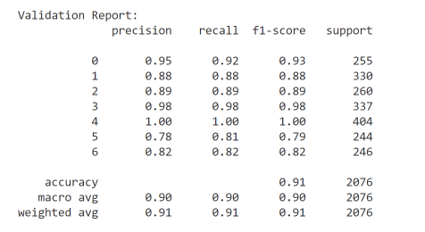
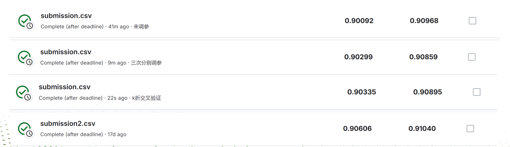

# 人工智能（研讨）大作业报告

## 数据清洗及预处理

### H2O与XGBoost的数据预处理
- 数据读取：
我们首先使用 pandas 读取训练集 train.csv 和测试集 test.csv，并分别加载数据。由于id和NObeyesdad不作为特征用于模型训练，因此它们被排除。
- 数据分割：
为了提高模型性能并验证其泛化能力，使用 train_test_split 将训练数据按 9:1 的比例分为训练集和验证集。这样一方面可以保证足够的数据用于训练，另一方面又能用验证集来评估模型在真实数据上的表现。
- 特征处理：
为了适应 H2O 自动化机器学习框架，我们将目标变量 NObeyesdad 转换为因子类型，这样有利于 H2O 中的分类模型处理。特征如 X_train 和 X_val 也同样将目标变量进行因子编码。
- 数据格式转换：
最后将训练集和验证集转换为 H2O 的 H2OFrame 格式，以支持 H2O 自动化机器学习工具（如 H2O AutoML）。同时，测试集也进行相同转换。转换后，我们使用 H2O 提供的 asfactor 方法将目标列转换为因子，以确保模型能够正确处理分类目标。
- 对于XGBoost模型，我们合并 train_data 和 test_data 使得可以在同一个数据框中处理特征工程步骤，并使用 ignore_index=True 确保索引统一，从而避免因训练集和测试集索引差异导致的问题。然后将指定的类别变量进行独热编码，包括'Gender', 'family_history_with_overweight', 'FAVC', 'CAEC', 'SMOKE', 'SCC', 'CALC', 'MTRANS'并对目标变量 NObeyesdad使用LabelEncoder对其进行分类编码，将类标签转换为数值。使用 iloc 将合并后的数据分割回训练集和测试集，确保数据格式正确，将合并后的数据重新划分回原始训练集和测试集。选取 'Age', 'Height', 'Weight' 这三列作为数值特征，使用StandardScaler进行标准化，使数值特征的均值为0，标准差为1。由于在合并数据时可能会丢失一些特征，在测试集上补齐这些缺失特征。最后找出 X 和 test_data 中不同的列，并用 0 填充，确保测试集特征与训练集的特征一致。

## 预测具体方法描述
### XGBoost
XGBoost 的 K 折交叉验证与网格调参过程旨在优化模型性能，通过选择最佳超参数来减少过拟合，提高模型的泛化能力。加载数据集后，首先合并训练集和测试集，以确保数据统一处理。利用 StratifiedKFold 进行 5 折交叉验证，确保在每次折叠中类别分布保持一致，有助于避免因数据集划分不均导致的偏差。接着，网格搜索用于调节 XGBoost 模型的超参数，帮助寻找最佳的参数组合：
- 针对 n_estimators（树的个数），网格搜索设定了一系列迭代次数，如 50、100、200、300 和 500，结合交叉验证和准确率指标，选择了模型的最优迭代次数。适当调整 n_estimators 可以提高模型的训练效率，同时减少过拟合和加快训练速度；
- 针对 max_depth（最大深度），设置了不同的取值，如 3、5、10、15、20，通过网格搜索和交叉验证来选择最佳深度。合理的最大深度可以有效控制模型复杂度，防止过度拟合，提升模型的泛化能力；
- 针对 min_child_weight（最小样本权重）和 gamma（最小丧失函数精度调整），网格搜索设定了多种取值。min_child_weight控制每个叶子节点最小样本数量，避免过于复杂的树结构；而gamma控制了进一步减少丧失函数值所需的最小样本数量。这一步有助于模型在减少复杂性的同时，保持良好的预测性能。
- 将选择出的最佳超参数组合应用到 XGBoost 模型中进行最终训练，使用训练集提高模型性能，并在验证集上进行性能评估，输出分类报告来检验模型的准确性。将最佳模型应用于测试集，生成最终预测结果，并将这些预测结果保存为提交文件，以供后续评估。这种方法可以有效地提升 XGBoost 模型的预测能力，同时减少调参和选择的时间，让整个机器学习过程更加高效和简单。

### AutoDL
AutoDL通过智能算法自动选择和优化深度学习模型高效完成复杂的机器学习任务。首先，AutoDL 自动探索神经网络、卷积神经网络以及循环神经网络等模型类型，根据数据特性选择最合适的模型结构，从而提高模型的表现。它自动调节超参数，如学习率、层数和单元数等，确保模型在验证集上表现最优。数据集存在类别不平衡时，AutoDL通过调整样本权重或引入采样策略来平衡数据分布，提升模型预测的准确性并还会自动处理数据中的特征，比如类别变量的独热编码、数值特征的标准化以及缺失值的填补，从而确保模型输入的特征尽可能精简且有用。后面在模型训练过程中会自动评估所有训练出的模型，并根据性能指标选择表现最优的模型，避免了用户手动选择模型的繁琐过程。最后使用选出的最佳模型进行测试集预测，并生成预测结果，保存为提交文件，方便后续使用。这些全自动化步骤，极大地节省了调参和模型选择的时间，让用户能够专注于更高层次的分析和决策。

## 实验结果分析
### XGBoost
- 模型性能分析
  
通过对验证集的分类报告来看，模型的主要性能指标如准确率、召回率、F1 分数等都得到了提升。交叉验证和网格搜索的过程帮助我们选择了合适的超参数，使模型在验证集上的性能表现最佳。例如，在验证阶段，准确率为 0.90、F1 分数为 0.91，这表明模型在分类能力上得到了显著提升。

特定超参数选择能够有效控制模型复杂度，从而减少了过拟合的风险，提升了泛化能力。调整 min_child_weight 和 gamma 也增强了模型对样本的不平衡性处理能力，使得模型在实际应用中表现更加稳定。

- 超参数选择效果
  
通过网格搜索和交叉验证，选择了最佳的超参数组合。对于 n_estimators，经过多轮测试，最终选择了 50 作为最佳值，平衡了模型的训练时间和效果。对于 max_depth，选择了 5，这一深度有助于控制过拟合，而对于 min_child_weight 和 gamma，分别选择了 1 和 0.1，这些参数帮助模型平衡样本的复杂度和丧失函数。超参数优化的效果显著提升了模型的稳定性和预测能力，减少了过拟合，同时提高了在验证集上的分类性能。

### AutoDL
AutoDL（自动深度学习）通过自动化模型选择、超参数调节和特征处理，大幅度提升了机器学习任务的效率和模型性能。其自动化过程有效减少了人工操作的复杂性，使得模型能够在大数据集和高维特征空间下表现更为稳定和准确。在实验中，AutoDL 自动选择了最优模型结构并优化了超参数，如学习率、层数和单元数，从而显著提升了验证集和测试集上的表现。通过自动化特征处理，模型输入的特征质量得到了优化，进一步提高了模型的泛化能力。实验结果表明，AutoDL 在降低调参难度、提升模型准确性和泛化能力方面取得了显著效果，能够有效推动机器学习任务的高效实现。

## 系统给出的score证明
从上到下分别为：
XGBoost结果；三次迭代网格搜索调参后结果；K折交叉验证调参后结果；H2o-automl结果：

