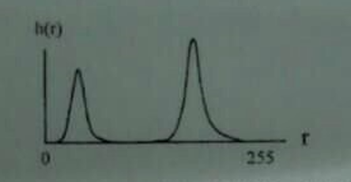

# 数字图像处理复习

## 【tips】

有的计算题写出公式也是得分点

考试题型：选择+4简答（有一个证明算法原理）+大题 

所有涉及的公式要写出来 

【其他知识】是这一章细碎的知识点但是复习课没有提到的

边缘检测要对图像进行平滑处理和阈值处理

## 数字图像基础

### 其他知识

#### 图像分辨率（传感器多密集）

指的是图像传感器上像素的密集程度，它决定了图像能够分辨的细节程度。例如，更高的图像分辨率意味着在相同的物理区域内有更多的像素，能够捕捉到更精细的物体结构和纹理。

#### 像素值的分辨率（模拟信号离散化的阶数）

这涉及到模拟信号转换为数字像素值的过程。它表示模拟信号离散化的精度，例如，对于一个 8 - bit 的像素值分辨率，像素值可以有256种不同的取值，这个阶数越高，能够表示的颜色或灰度层次就越丰富。

#### 信噪比

是信号与噪声的功率比，在图像中，信号是有用的图像信息，噪声是干扰图像的因素。高信噪比意味着图像质量较好，信号强度相对噪声较强，图像中的细节和颜色等信息更清晰；低信噪比则表示图像可能被噪声污染，影响图像的视觉效果和后续处理。

#### 线对

1线对=2像素 eg.一张图像像素是2048*2048 那么线对数目就是2048/2=1024，正方形的都相等；

分辨率是线对数目/空间长度 eg.图像大小5cm*5cm那么分辨率2048/2/5

dpi只是单位不同 点数/英寸不用/2 点数就是像素数

#### 图像像素间关系

4/8/m临接

#### 空间变换

#### 图像配准

#### 插值算法

线性变换中的像素位置遍历和插值原因

- 在进行线性变换时，当遍历原像素位置并进行变换后，目标图像的像素值可能会出现空缺**（不一定恰好得到所有目标位置的值）**。这是因为线性变换后的像素位置可能与原图像的像素网格不完全匹配。
- 遍历目标图像像素，根据坐标映射逆映射得到在原始图像的位置，这个位置不一定落在原图像的像素点上，因此需要通过邻域像素的插值来得到不存在的像素值，以保证目标图像的完整性。

不能贸然使用多项式插值的原因（伪影问题）

- 多项式插值可能会产生伪影。因为如果随意使用多项式插值，可能会**改变已经有值的点**，而实际要求这些点必须和原值一样。不当的插值可能会引入不符合实际图像内容的虚假信息，导致在图像中出现不应该有的图案或扭曲，影响图像质量。

### 线性证明

> 
>
> 
>
> 

## 灰度变换与空间滤波

### 其他知识

#### 灰度变换函数

γ：处理之前要先归一化，[0,256) -> [0,1)，最后再调整到[0,256)。

#### 比特平面变换

直接把图像每个点像素值转化为n（课本上是8）的二进制然后每个平面对应每一位

#### 直方图规定化？

#### 空间滤波

#### 线性滤波器用于降噪和锐化边界的可行性与局限性

可行性：
降噪方面：在图像中，噪声通常多分布在**高频分量**，而图像信号本身的高频能量相对较小，高频分量的信噪比小。线性滤波器可以通过衰减高频分量来减少噪声。例如，低通滤波器可以让低频分量通过，而抑制高频分量，从而达到降噪的目的。
锐化边界方面：边界通常代表高频分量，因为边界处的像素值变化剧烈。通过设计合适的线性滤波器来增强高频分量，可以锐化边界，使图像中的物体轮廓更加清晰。
局限性：
在降噪过程中，滤波器在去除噪声的同时往往会模糊边界，因为边界信息也包含在高频分量中。而在锐化边界时，由于噪声也在高频分量中，会放大噪声。所以在实际应用中，需要在降噪和保持边界清晰度、锐化边界和控制噪声放大之间进行权衡。

##### 卷积和相关

##### 均值平滑滤波器（盒式滤波|加权平均|低通高斯）

##### 统计排序滤波器

##### 一阶导数锐化

##### 钝化掩蔽和高提升滤波

就是原图-模糊图像得到的模板和原图相加，然后高提升就是想家的时候让模板值更大

##### 二阶导数锐化

### 【必考】直方图均衡化

灰度直方图：统计在图像中具有该灰度值的像素个数出现的频数，并绘制成的图形。

归一化直方图：p（k）=nk/n
像素出现的频数= 灰度级为k的像素点个数/总像素个数

直方图均衡，gamma校正：它们**非线性**，会改变频率信息，因此要在均值滤波之后。将灰度映射安排在最后。

直方图**均衡化**可实现图像的**自动增强**，但效果不易控制，得到的是**全局增强**的结果。
直方图**规定化**可实现图像的**有选择增强**，只要给定规定的直方图，即可实现**特定增强**的效果。。

#### 增加图像对比度的原理

直方图均衡是一种通过改变图像的直方图分布来增强图像对比度的方法。其原理是基于直方图分布越均匀，图像对比度越好。通过调整图像像素的灰度值，使图像的灰度直方图变得更加均匀，这样就能够将原本集中在某个灰度范围的像素值分散到更广泛的灰度范围，从而增强了图像中亮部和暗部之间的差异，达到增强整体对比度的效果。

#### 步骤


#### 例题

> 某人拍摄了一幅灰度图像，其灰度直方图 h (r) 如下图所示。请问：（共 20 分）
>
> 
>
> （1）该图像最有可能表现出以下哪种视觉特性？请说明理由（5 分）
>
> (a) 图像整体偏暗
>
> (b) 图像整体偏亮
>
> (c) 图像具有极高的细节清晰度
>
> (d) 图像呈现类似于明暗对立的剪影效果，细节分辨不清
>
> （2）该图像最有可能是在以下哪种场景下拍摄的？请说明理由（5 分）
>
> (a) 照明条件良好的教室
>
> (b) 多云天气下的室外运动场
>
> (c) 雪地拍摄人像
>
> (d) 大雾条件下的街区
>
> （3）下图所示 4 种灰度映射曲线（图中，r 表示输入图像灰度，s 表示输出图像灰度）中，哪些不可能有助于提高人像的细节分辨能力？请说明理由（10 分）
>
> 

答案：d；d；cd

#### 缺点

1.增强效果不易控制，处理的结果总是得到全局均匀化的直方图。
2.均衡化图像的动态范围扩大，本质上是扩大了量化间隔，但量化级别（灰度级）
可能减少了，导致某些图像细节消失。
3.对于直方图存在高峰的图像，经处理后对比度可能过分增强。
4.原来灰度值不同的像素经过处理后可能变为相同，从而形成一片灰度值相同的区
域，各区域之间有明显的边界，导致出现伪轮廓。

### 【必考】滤波器

> 低通滤波器常被用来抑制图像中的噪声，请简述其合理性。（10 分）

> - 图像中的噪声通常包含高频成分，而低通滤波器的作用是允许低频信号通过，衰减高频信号。
> - 在图像中，低频成分主要对应图像的整体结构和缓慢变化的区域，而噪声作为高频成分，经过低通滤波器后被抑制，从而减少了噪声对图像的影响，使得图像看起来更加平滑和干净，所以低通滤波器常被用来抑制图像中的噪声。
>


## 频率域滤波【不用管怎么算的】

为什么在频域做xxx：

- 通过在频域分析不同频率分量的特性，可以更好的描述降噪/锐化等任务，带来图像增强的全新思路。
- 可以在频域指定滤波器，做反变换，指导空间域的滤波。
- 空间域卷积，频域相乘，计算量小。

### 其他知识

#### 频率域低通滤波器

理想低通滤波器

振铃现象：高阶巴特沃斯低通滤波会出现振铃现象，高斯滤波不会：

在空间域将低通滤波作为卷积过程来理解的关键是h(x,y)的特性：可将h(x,y)分为两部分：原点处的中心部分，中心周围集中的成周期分布的外围部分。前者决定模糊，后者决定振铃现象。若外围部分有明显的震荡，则g(x,y)会出现振铃。利用傅里叶变换，我们发现，若频域滤波函数具有陡峭变化，则傅里叶逆变换得到的空域滤波函数会在外围出现震荡。

巴特沃斯低通滤波器

高斯高通滤波器

#### 高通滤波器

同态滤波

#### 带阻滤波器

### 【必考】采样

⭐奈奎斯特采样在现实中无法完美复现，因为是不带限的

### 傅里叶变换【抄公式】

| 时间域               | 频率域                                   |
| -------------------- | ---------------------------------------- |
| 周期连续，如余弦函数 | 非周期离散，偶对称的两个冲激函数         |
| 非周期连续           | 非周期连续，频域连续因为时域非周期       |
| 周期离散             | 周期离散，频域周期因为时域离散           |
| 实信号               | X(ω)共轭对称，不同频率分量的虚部两两抵消 |

> 注意！频域图像的中心是低频，越往边缘越高频，傅里叶变换后做中心化后才能表示正确的频谱图像，频率大小和亮度无关，越亮只能说明这部分频率占比约大，比如中间是亮的图像代表图像大部分是低频。


频域反应了图像在**空域灰度变化剧烈程度**，也就是图像灰度的变化速度，也就是图像的**梯度大小**。对图像而言，图像的边缘部分是**突变**部分，变化较快，因此反应在频域上是**高频**分量；图像的**噪声大部分情况下是高频部分**；图像**平缓变化部分则为低频分量**。

也就是说，傅立叶变换提供另外一个角度来观察图像，可以将图像从灰度分布转化到频率分布上来观察图像的特征。书面一点说就是，傅里叶变换提供了一条从空域到频率自由转换的途径。

相关概念：

- 图像高频分量：图像突变部分；在某些情况下指图像边缘信息，某些情况 下指噪声，更多是两者的混合；
- 低频分量：图像变化平缓的部分，也就是图像轮廓信息
- 高通滤波器：让图像使低频分量抑制，高频分量通过
- 低通滤波器：与高通相反，让图像使高频分量抑制，低频分量通过
- 带通滤波器：使图像在某一部分 的频率信息通过，其他过低或过高都抑制
- 还有个带阻滤波器，是带通的反。

#### 傅里叶级数用于测线性系统阻抗

傅里叶级数是一种将周期函数表示为正弦和余弦函数的无穷级数。在线性系统中，当输入为周期信号时，系统的响应也可以用傅里叶级数来表示。对于一个线性时不变系统，其阻抗是一个重要的特性。通过将输入信号分解为傅里叶级数（例如，由 20 个波叠加的信号），可以分别分析每个频率分量在系统中的响应，进而测量系统的阻抗。因为在频域中，线性系统对不同频率的正弦信号的响应特性（如幅度和相位变化）可以用来确定阻抗。

#### 一次 DFT 做两个实数序列

离散傅里叶变换（DFT）是傅里叶变换在离散信号上的应用。通常情况下，DFT 是对一个复数序列进行变换。但可以通过一定的技巧，将两个实数序列组合成一个复数序列进行 DFT 运算，这样可以在一次 DFT 运算中同时处理两个实数序列，提高计算效率。例如，设两个实数序列为和，可以构造一个复数序列，对进行 DFT 后，通过一定的运算可以从结果中分离出和的 DFT 结果。

### 傅里叶变换的一些性质|再看！！！

平移性：


注：u和v是频率变量，x和y是空间域图像变量
公式（1）表明将f(x,y)与一个指数项相乘就相当于把其变换后的频域中心f(u,v) 移动到新的位置 f(u-uo,v-v0)
公式（2）表明将F(u,v)与一个指数项相乘就相当于把其变换后的空域中心f(x,y) 移动到新的位置 f(x-x0,y-y0)
公式（2）表明对f(x,y)的平移不影响其傅里叶变换的幅值

可分离性：

> 请从理论上证明可以使用长度为 N 的一维 FFT 模块完成尺寸为 N×N 的图像的傅里叶变换，并给出算法流程图。（10 分）


### 二维傅里叶变换

#### 计算步骤

 先通过沿输入图像的每一行计算一维变换
 再沿中间结果的每一列计算一维变换
 可以改变上述顺序，即先列后行
 上述相似的过程也可以计算二维傅里叶反变换

二维快速傅里叶变换（FFT）用于处理二维信号，如数字图像。它可以拆解为先后对两个方向（通常是x方向和y方向）进行一维 FFT。首先对图像的每一行进行一维 FFT，将每行的像素值替换为该行的 FFT 结果，这样就得到了一个在x方向进行频域变换后的中间结果。然后，对这个中间结果的每一列进行一维 FFT，就完成了二维 FFT。这种拆解方式利用了一维 FFT 的高效算法，大大减少了计算量。

#### 二维傅里叶变换F(0,0)：整个图像灰度平均值


### 快速傅里叶变换

只是傅里叶变换的快速算法罢了

- 一个M个点的变换，能够通过将原始表达式分成两个部分来计算
- 通过计算两个（M/2）个点的变换。得Feven(u)和 Fodd(u)
- 奇部与偶部之和得到F(u)的前(M/2)个值
- 奇部与偶部之差得到F(u)的后(M/2)个值。且不需要额外的变换计算
- 思想：（1）通过计算两个单点的DFT，来计算两个点的DFT， （2）通过计算两个双点的DFT，来计算四个点的DFT，…，以此类推
  （3）对于任何N=2m的DFT的计算，通过计算两个N/2点的DFT，来计算N个点的DFT

### 傅里叶变换的意义

图像的频率是表征图像中灰度变化剧烈程度的指标，是灰度在平面空间上的梯度。

## 图像复原与重建

### 其他知识

#### 图像退化步骤

#### 噪声类型|对应各种噪声的处理滤波方式

加性噪声：空间滤波

周期性噪声：频域滤波

#### 退化模型

大气湍流模型

运动模型

#### 退化复原

逆滤波

- 逆滤波是一种试图恢复降质图像的方法。然而，降质函数通常是低通滤波器，这会导致高频分量的值很小。而噪声多分布在高频分量，在逆滤波过程中，由于要对降质图像进行恢复操作，会显著放大高频分量，从而放大了噪声，使得恢复后的图像质量可能会更差。

维纳滤波

最小均方误差滤波

#### 图像重建

### 【判断周期性噪声在频域是什么样子的然后根据这个去除噪声】

## 彩色图像处理【easy选择】

### 其他知识

#### RGB|CMY|CMYK|HSI

#### 彩色图像直方图

#### 彩色图像边缘检测|平滑|锐化

## 小波变换【easy图像处理|边缘提取|去噪】

### 其他知识

#### 计算图像金字塔

图像金字塔：计算图像缩放

下采样两个步骤：

- 利用低通滤波器平滑图像【对图像Gi进行高斯卷积核（**高斯滤波**）】
- 对平滑图像进行抽样（采样）

EG.高斯金字塔：

首先将原图像作为最底层图像 level0（高斯金字塔的第0层），利用高斯核（5*5）对其进行卷积，然后对卷积后的图像进行下采样（去除偶数行和列）得到上一层图像G1，将此图像作为输入，重复卷积和下采样操作得到更上一层的图像，反复迭代多次，形成一个金字塔形的图像数据结构，即高斯金字塔。

EG.拉普拉斯金字塔

拉普拉斯金字塔的一级是由那一级的高斯金字塔和它的更高一级高斯金字塔的**图像差别**来生成的

注：由于每次向下取样会删除偶数行和列，所以它会不停地丢失图像的信息。

上采样两个步骤：

- 将图像在每个方向上扩大为原图像的2倍，新增的行和列均用0来填充
- 使用与“向下取样”相同的卷积核乘以4，与放大后的图像进行卷积运算，以获得“新增像素”的新值。

PS.向上采样和乡下采样不是互逆操作，两次变换后不能恢复原图像。


## 图像压缩和水印

### 其他知识


#### 图像压缩方法

### 图像冗余

要知道是什么样的冗余：

编码冗余

时间和空间冗余

感知冗余

### 【必考】图像压缩

处理冗余？

> 压缩比和失真率是评价图像压缩算法性能的两个主要参数。请问：（共 10 分）
>
> - （1）它们分别表达了算法的什么性能？它们之间又存在怎样的关系？（5 分）
> - **答案解析**：压缩比表示图像压缩前后数据量的比率，反映了算法对图像数据的压缩程度，压缩比越高，说明数据压缩得越厉害；失真率则衡量了压缩后图像与原始图像相比质量的下降程度，失真率越低，图像质量越接近原始图像。一般来说，压缩比越高，往往会导致失真率增大，即压缩程度越大，图像质量损失可能越严重，但不同的压缩算法在相同压缩比下的失真率可能不同，好的压缩算法可以在较高压缩比下保持较低的失真率。
> - （2）JPEG 标准中的品质因子与它们之间的关系是什么？（5 分）
> - **答案解析**：JPEG 标准中的品质因子与压缩比和失真率密切相关。品质因子越高，压缩比相对越低，失真率也越低，图像质量越好；品质因子越低，压缩比相对越高，失真率越高，图像质量越差。用户可以通过调整品质因子来平衡压缩比和图像质量之间的关系，以满足不同的应用需求。

### 【必考】霍夫曼编码

#### 编码步骤


画就好 大的值写0 小的值写1

#### 压缩率

先算信息熵：


也就是每个概率和他们的log相乘再相加的相反数：


然后算平均码长L：用每个编码的长度乘以出现概率然后相加

然后算编码效率：**信息熵/平均码长**


然后算压缩比：**比特数/平均码长**


相对数据冗余：
$$
R=1-1/C
$$


### 【补充】比特平面编码

#### m比特格雷码更好

格雷码是一种二进制编码方式，它的特点是相邻的两个代码之间只有一位不同。例如，对于 3 位格雷码，其编码序列为 000、001、011、010、110、111、101、100。

在对比特平面进行编码时，尤其是在量化等操作过程中，如果使用二进制码，当位平面的值发生变化时（例如从 0111 到 1000），可能会有多位同时变化。而使用格雷码可以更好地降低误差扩散的影响。因为格雷码相邻值只有一位变化，所以在编码过程中产生的误差不容易在多个位之间快速传播，使得误差更局部化。

#### 二进制比特平面分解

将每个像素的二进制表示的每一位分离出来形成不同的平面。以一个简单的 4 位像素值为例，假设像素值为 1010，那么最高有效位平面的值为 1，次高位平面的值为 0，次低位平面的值为 1，最低有效位平面的值为 0。

### 数字图像水印

#### LSB水印

是基于图像像素值的二进制表示来嵌入水印信息。在一幅数字图像中，每个像素的颜色值（如对于 8 位灰度图像，像素值范围是 0 - 255，用 8 位二进制表示）都有多个位。LSB 方法是将水印信息嵌入到像素值的最低有效位（LSB）中。例如，对于一个像素值 100（二进制表示为 01100100），如果要嵌入水印比特 0，那么修改后的像素值可能变为 100（二进制 01100100）不变；如果要嵌入水印比特 1，像素值可能变为 101（二进制 01100101）。

**抵抗有意对图的更改**：例如，对于一些不改变图像像素值最低位的操作，如亮度和对比度的轻微调整，可能不会破坏水印。因为这些操作通常是基于像素值的整体变换，只要变换后的像素值舍入等操作不改变最低位，水印就能够保留。

#### PCT鲁棒水印

对图像进行主成分变换，然后将水印信息嵌入到主成分系数中。例如，通过对图像矩阵进行特征分解，得到一组特征向量和对应的特征值，这些特征值对应的特征向量就是主成分。水印可以嵌入在这些主成分的系数上，嵌入方式可以是通过加法、乘法等运算。

**抵抗水印攻击**：这种水印技术对几何攻击（如旋转、缩放、平移）具有较好的抵抗能力。因为主成分是基于图像的整体结构和能量分布的，当图像经过几何变换后，虽然像素位置等发生了变化，但图像的主要成分在一定程度上仍然保持相对稳定。例如，当图像旋转一定角度后，通过适当的逆变换和重新对齐主成分，可以在一定程度上恢复水印信息。


## 形态学图像处理

为什么面积分割和边界分割是等价的：可以用
$$
\part X=X-(X\ominus B)
$$
（我减我的腐蚀）面积 → 边界，用形态学的区域填充 边界 → 面积。

### 腐蚀和膨胀

### 开运算和闭运算

### 骨架提取和形态学重建【概率考】

### 【必考】重建开运算流程

## 图像分割

为什么前景后景距离，一个d4一个d8：

- 
- 比如前景背景都是d8，中心点与右上点邻接，但它们被上和右两个点围起来了，相当于一堵围墙，本应不邻接的，产生了歧义。
- 前景背景都是d4：不邻接，但也没有墙。

### 其他知识

对于不连续的：

基于灰度值，第一类，区域的边界彼此完全不同而且和背景不同，能够根据灰度的局部不连续性检测出边界：基于边缘的分割；第二类，区域内部有一些纹理：基于区域的分割

？不知道

### 梯度计算【考】

### 两种边缘检测流程【canny考很多次了】

#### 【必考】大题分割|方法开放|结合题目谨慎选择|写公式根据效果评分

ostu流程有可能考

区域生长不好理解

分裂和聚合应该不考

# 设计题

## 要考虑的步骤

### 图像预处理

#### **灰度化：把彩色图像转化为灰度图像**

- 平均法：将彩色图像中每个像素的红、绿、蓝三个通道的值进行平均，得到对应的灰度值。

#### 图像去噪

各种滤波方法

空间域滤波：

均值滤波器：图像中**噪声较为均匀且图像细节相对不那么重要的**情况。比如在一些监控视频图像中，如果噪声是较为平稳的高斯噪声，且主要关注的是图像中的大目标物体的大致轮廓，均值滤波器可以在一定程度上平滑图像，减少噪声的影响。但要注意其会模糊图像的细节。

中值滤波器：对于**椒盐噪声**有很好的抑制效果。如果图像中存在明显的椒盐噪声，如在一些老旧的印刷图像数字化后，或者经过某些信道传输后出现的随机亮点和暗点噪声，中值滤波器能够有效地去除这些噪声，同时较好地保留图像的边缘和细节信息。

统计排序滤波器：像修正阿尔法均值滤波器等在处理**多种噪声混合**的情况时表现较好。例如在实际的医学图像中，可能**同时存在高斯噪声和椒盐噪声**，以及一些由于设备特性导致的其他类型噪声，统计排序滤波器可以根据图像的局部统计特性进行灵活的滤波操作。

自适应滤波器：当图像**不同区域的噪声特性差异较大**时，自适应滤波器是首选。例如在一幅包含不同光照条件区域的图像中，或者图像中既有平滑区域又有纹理丰富区域且噪声分布不均匀的情况下，自适应滤波器能够根据每个像素的邻域统计信息动态调整滤波参数，在去除噪声的同时更好地保留图像的细节。

频域滤波：主要用于去除图像中的**周期性噪声**。如果图像中存在明显的周期性干扰条纹，如在某些电子设备的图像采集过程中受到电源频率干扰产生的条纹噪声，或者在一些扫描图像中由于机械结构的周期性运动产生的噪声，陷波滤波器可以通过在频域中识别并抑制这些特定频率的噪声，从而有效地恢复图像的质量。

陷波滤波器

**椒盐噪声**：中值滤波器

**高斯噪声**：均值滤波器（一定程度上模糊图像）/自适应滤波器（去除噪声+保留图像细节）

### 图像增强

包括突出细节、去除噪声

#### 亮度和对比度

**偏暗/偏亮**：线性变换改变灰度值比例

**对比度低**：对数变换/幂律变换扩展灰度范围

**灰度分布集中**：直方图均衡化，提高图像对比度

> 比如暗图像可以幂律变换让γ<1扩展暗像素值，让图像变亮增强暗区细节

#### 边缘和细节增强

基于一阶导数的 Sobel 算子或 Roberts 交叉梯度算子可以计算图像的梯度，增强边缘；基于二阶导数的拉普拉斯算子能检测图像中的过零点，进一步突出边缘和细节，但可能会使图像**噪声更明显，所以通常在去噪后使用**。例如，对于需要突出物体轮廓的图像，可应用 Sobel 算子进行边缘检测和增强。

### 图像复原（如果存在退化）

退化的复原技术

方法：

逆滤波

维纳滤波

约束最小二乘方滤波

对于运动模糊，可根据运动模型**估计退化函数**，然后采用逆滤波、维纳滤波或约束最小二乘方滤波等**方法进行复原**。逆滤波简单地将退化图像的频谱除以**退化函数**的频谱，但对噪声敏感，通常需要结合**低通滤波器**限制频谱范围；维纳滤波通过考虑**图像和噪声**的功率谱，在去模糊和抑制噪声之间取得较好的平衡；约束最小二乘方滤波则通过引入**约束条件**优化复原结果。

**流程：1、对图像进行傅里叶变换，变换到频域。2、利用观察法/试验法/建模法估计退化函数H，并给出H的表达式。3、使用逆滤波/维纳滤波/最小二乘方滤波进行复原。4、傅里叶反变换得到空间域滤波复原的图像。**

### 特征提取

- **颜色特征提取**：
- **纹理特征提取**：
- 形状特征提取：
- **边缘特征提取**：当图像中物体与背景的边界较为清晰且需要精确获取物体轮廓时，使用 Canny 算子检测图像的边缘。在图像识别任务中，如识别图像中的几何图形，边缘特征是重要的依据。

### 图像分割

根据直方图选择合适的阈值

分割方法：

**基于阈值**：图像的灰度**直方图**呈现明显的双峰或多峰分布。如果特定形状或信息的灰度值相对集中且与背景有明显差异，可以采用全局阈值分割，如最大类间方差法（Otsu 算法）自动确定最佳阈值；若图像不同区域的灰度分布差异较大，则可采用局部阈值分割，根据局部区域的灰度特性来确定阈值。

**基于边缘检测**（边缘检测后要使用连接算法，让边缘像素组合为有意义的边缘和或区域边界）：对于**形状规则、边缘明显**的物体图像，如机械零件图像，基于边缘检测的分割方法更有效。在工业自动化生产中的零件检测环节，可利用这种方法判断零件的形状和尺寸是否符合标准。**Sobel 算子**通过计算**水平和垂直方向的梯度**来检测边缘；Canny 算子则先进行高斯滤波去噪，然后计算梯度**幅值和方向**，通过非极大值抑制和双阈值检测等步骤得到较为精确的边缘。基于边缘的分割能够准确地定位特定形状或信息的边界，但可能会受到噪声和图像纹理等因素的影响，导致边缘检测不准确或出现断裂等问题，因此通常需要在去噪和增强对比度等预处理后进行，并且可能需要结合其他分割方法来完善分割结果。

**小波变换来提取边缘**

1、选择小波和分解级别。选择合适小波基（如dbN系列，N按需选）及分解级别数P，P取决于图像复杂度与边缘细节要求，高P可提更精细边缘但增计算量。

2、小波分解。对原始图像行FWT，分解为不同尺度和方向小波系数，各分解级别含1个低频近似系数与3个高频细节系数（水平、垂直、对角）。

3、边缘特征提取与处理①边缘系数提取：关注各分解级高频细节系数，设阈值提取可能边缘系数。 ②边缘系数增强：对边缘候选系数加权（乘大于1常数）突出边缘。 ③其他调整：可删最低尺度近似分量或某方向细节分量（如水平）以提取特定边缘。

4、小波重建。基于原始低频近似系数与处理后高频细节系数，在P级执行小波逆变换，得含增强边缘信息图像。

**基于区域**：当图像中目标物体具有相对均匀的灰度或纹理或颜色特征时，可以选择区域生长方法。例如在医学图像中对肿瘤区域的分割，如果肿瘤区域在灰度或纹理上相对一致，通过**选择合适的种子点**并根据相似性准则进行**区域生长**，可准确提取肿瘤区域。在一些复杂图像中，可能需要**结合多种分割方法**，如先进行阈值分割大致分离出目标区域，再利用区域生长或其他方法进一步细化分割结果。比如在遥感图像中，先通过阈值分割分离出可能的地物区域，再用区域生长方法进一步精确提取不同类型的地物。例如区域生长算法，先选择一些种子点，然后根据一定的相似性准则（如灰度差小于某个阈值）将邻域像素合并到种子点所在区域；或者采用分水岭算法，将图像看作地形表面，通过模拟注水过程来分割不同的区域。

如果**目标与背景灰度差异明显且直方图呈双峰或多峰分布**，可采用**阈值分割**方法，如 Otsu's 法自动确定阈值；若图像具有丰富的**纹理信息**，可使用基于纹理特征的分割方法，如灰度共生矩阵提取纹理特征后进行**聚类或分类**；对于**形状规则**的物体，**基于边缘检测**的分割方法（如 Canny 算子检测边缘后进行轮廓提取和分析）可能更有效。在一些**复杂图像**中，可能需要结合多种分割方法，如**先进行阈值分割大致分离出目标区域，再利用区域生长或其他方法进一步细化分割结果。**

### 计算连通域

- 在图像分割后，对于需要**统计图像中独立物体数量或分析物体之间连接关系**的情况，计算连通域。例如在电路板检测中，计算连通域可以确定电子元件的数量和位置关系，判断是否存在短路或断路等问题。通过对二值图像进行标记算法，如使用 4 邻域或 8 邻域标记法，识别出不同的连通区域，并**统计其数量、面积、周长**等属性，为后续的分析和决策提供依据。

### 分类与识别（如果需要）

可以使用机器学习算法，如支持向量机（SVM）、决策树、随机森林等，或者深度学习方法，如卷积神经网络（CNN）等。这些算法通过训练模型，学习特征与类别之间的映射关系，然后对新的图像数据进行分类或识别。分类与识别是整个流程的最终目标，通过训练好的模型，可以自动地对图像中的特定形状或信息进行准确的分类和识别，提高处理效率和准确性。例如，在医学图像中，可以通过提取病变区域的特征并进行分类，辅助医生进行疾病诊断；在工业检测中，可以识别产品中的缺陷形状等。

### 后处理（如果需要）

对提取的结果进行进一步的优化和完善，例如**去除小的噪声区域、填充孔洞、连接断裂的边缘**等，使提取的特定形状或信息更加完整和准确。可以采用形态学操作，如腐蚀、膨胀、**开运算、闭运算等**。腐蚀可以去除小的噪声区域和细化边缘；膨胀可以填充孔洞和连接断裂的边缘；开运算先腐蚀后膨胀，用于去除小的物体和噪声；闭运算先膨胀后腐蚀，用于填充孔洞和连接区域。

### 图像压缩（如果需要存储/传输）

冗余分析：仔细观察图像的颜色分布、像素相关性等情况。对于颜色较为单一的图像，如纯色背景的证件照片，可能存在较多的空间冗余；对于某些细节对视觉影响较小的图像，如监控视频中的背景区域，存在一定的感知冗余。

压缩方法：

无损压缩：

- 霍夫曼编码：适用于**各种图像类型**，尤其是当图像中某些像素值或符号出现的概率差异较大时，能显著减少编码冗余。例如在文本图像中，字符的出现频率往往不同，霍夫曼编码可以根据字符的概率分布为其分配不同长度的编码，从而有效压缩数据。

- 算术编码：对于**数据的概率分布**有较好适应性，能实现较高的压缩比。在一些对**压缩效率要求较高且对编码和解码速度要求不是特别苛刻的情况**下，算术编码是不错的选择，如在一些数据存储系统中对图像数据的压缩。

- 行程编码：如果图像中**存在大量连续相同的灰度值或颜色值**，如在简单的黑白线条图或某些具有大面积相同颜色区域的图像中，行程编码可以通过记录灰度值和连续出现的次数来大幅压缩数据。

有损压缩：

- JPEG编码：适用于对图像质量有一定要求但可以接受一定损失的情况，如在互联网上传输普通的彩色照片或在数码相机中存储图像。它将图像分块进行 DCT 变换，对变换后的系数进行量化和编码，能获得较高的压缩比。对于自然场景照片，JPEG 编码可以在保持图像整体视觉效果的前提下，有效减小文件大小。
- 小波编码

分析图像中的编码冗余、空间冗余和感知冗余等情况。例如，对于**颜色较为单一**的图像，可能存在较多的空间冗余；对于**某些细节对视觉影响较小**的图像，存在一定的感知冗余。

对于无损压缩需求，可采用霍夫曼编码、算术编码、行程编码等方法。霍夫曼编码根据符号出现的概率构建最优变长码，能有效减少编码冗余；行程编码适用于存在连续相同灰度值的图像，通过记录灰度值和连续出现的次数来压缩数据。对于可以接受一定图像质量损失的情况，可采用有损压缩方法，如 JPEG 编码（基于离散余弦变换 DCT）或小波编码（如 JPEG2000 采用的方法）。JPEG 编码将图像分块进行 DCT 变换，对变换后的系数进行量化和编码，能获得较高的压缩比，但会有一定的图像质量损失；小波编码则通过选择


## 例题

> 
>
> 在显微镜下拍摄的有核细胞图如下图所示，请设计一个全自动的图像处理系统统计图中细胞核面积占比的平均值（细胞核面积占比定义为细胞核面积与该细胞总面积之比）。要求：（共 30 分）
> - （1）分析图像的性质，描述设计思路（10 分）
> - **答案解析**：图像性质分析：显微镜下的细胞图像通常具有对比度较低、细胞边界模糊、细胞核与细胞质灰度差异不明显等特点，且可能存在噪声干扰。
>   设计思路：首先进行图像预处理，包括灰度化（将彩色图像转换为灰度图像，简化后续处理）、滤波（如中值滤波等去除噪声）、对比度增强（如直方图均衡化等提高细胞核与细胞质的对比度）；然后进行图像分割，可采用阈值分割（根据细胞核与细胞质的灰度差异选择合适的阈值将细胞核与细胞质分离）或基于边缘检测的分割方法（如 Canny 算子等检测细胞边界，再通过形态学操作等完善分割结果）；接着对分割后的细胞核进行标记和面积计算，统计所有细胞的细胞核面积和细胞总面积，最后计算细胞核面积占比的平均值。
> - （2）画出系统框图并简要描述框图中的各处理单元使用的算法（15 分）
> - **答案解析**：
>
> ```flow
> st=>start: 开始
> img_in=>inputoutput: 输入显微镜下细胞图像
> gray=>operation: 灰度化（平均法/加权平均法等）
> filter=>operation: 滤波（中值滤波等）
> enhance=>operation: 对比度增强（直方图均衡化等）
> segment=>operation: 图像分割（阈值分割/基于边缘检测的分割等）
> label_area=>operation: 细胞核标记与面积计算（连通域标记等）
> calc_ratio=>operation: 计算细胞核面积占比平均值
> output=>inputoutput: 输出细胞核面积占比平均值
> end=>end: 结束
> 
> st->img_in->gray->filter->enhance->segment->label_area->calc_ratio->output->end
> ```
>
> 
>
> - 灰度化单元：可采用平均法（）或加权平均法（如）将彩色图像转换为灰度图像。
> - 滤波单元：中值滤波，对于图像中的每个像素，取其邻域内像素灰度值的中值作为该像素的输出灰度值，可有效去除椒盐噪声等。
> - 对比度增强单元：直方图均衡化，通过对图像的灰度直方图进行变换，使图像的灰度分布更加均匀，从而提高图像的对比度。
> - 图像分割单元：阈值分割，根据图像的灰度直方图或其他方法确定一个合适的阈值，将图像分为细胞核和细胞质两部分；基于边缘检测的分割，如 Canny 算子，通过计算图像梯度等方法检测边缘，再通过形态学闭运算等操作填充边缘内部的空洞，得到完整的细胞区域，然后根据细胞区域和细胞核的灰度差异等进一步分割出细胞核。
> - 细胞核标记与面积计算单元：连通域标记算法，对分割后的细胞核区域进行标记，统计每个连通域（即每个细胞核）的像素个数，从而得到细胞核的面积；同时统计细胞的总面积（可通过对整个细胞区域进行像素计数得到）。
> - 计算细胞核面积占比平均值单元：将所有细胞核的面积之和除以所有细胞的总面积，得到细胞核面积占比的平均值。
> - （3）简要描述所设计的处理系统可能存在的问题以及应对方案（5 分）
> - 答案解析：
>   - 可能存在的问题：
>     - 图像预处理效果不佳，如噪声去除不彻底或对比度增强过度等，影响后续分割。
>     - 图像分割不准确，如阈值选择不合适导致细胞核分割不完全或过度分割，边缘检测不准确等。
>     - 细胞粘连或重叠，导致难以准确分割每个细胞和细胞核。
>   - 应对方案：
>     - 对于预处理问题，可尝试多种滤波方法和对比度增强参数，根据实际效果选择最优组合；也可以采用自适应滤波和增强算法。
>     - 对于分割不准确问题，可采用多种分割方法结合，如先阈值分割后进行形态学修正，或者结合机器学习方法进行分割，根据图像特点训练模型。
>     - 对于细胞粘连或重叠问题，可采用基于形态学的分离算法，如分水岭算法等，或者在细胞培养和制片过程中尽量避免细胞过度密集。

> 计算机断层扫描（CT）拍到了一副肺部图像。请设计一种处理流程完成箭头所指肺结节和血管的提取。（20 分）
> （1）画出处理流程的框图；（8 分）
> （2）描述框图中各处理步骤的作用；（8 分）
> （3）描述框图中各处理步骤选用的具体算法、公式，以及选择此算法的理由；（4 分）
>
> 
>
> ### 处理流程框图：
>
> 1. 图像预处理
>    - 灰度化
>    - 滤波去噪（中值滤波）
> 2. 特征提取
>    - 纹理特征提取（灰度共生矩阵）
>    - 边缘特征提取（Canny 算子）
> 3. 图像分割
>    - 阈值分割（Otsu's 法）
>    - 区域生长（基于纹理和灰度相似性）
> 4. 后处理
>    - 去除小区域
>    - 填充孔洞
>
> ### 各处理步骤的作用：
>
> 1. 图像预处理
>    - **灰度化**：将彩色的肺部 CT 图像转换为灰度图像，减少数据量和后续处理的复杂度，同时突出肺部组织的灰度差异，便于后续处理。
>    - **滤波去噪（中值滤波）**：肺部 CT 图像中可能存在噪声，中值滤波可以有效地去除椒盐噪声等，同时较好地保留肺部组织的边缘和细节信息，避免噪声对后续特征提取和分割的干扰。
> 2. 特征提取
>    - **纹理特征提取（灰度共生矩阵）**：肺部结节和血管与周围正常组织在纹理上可能存在差异，通过灰度共生矩阵可以提取出对比度、相关性、能量、熵等纹理特征，这些特征有助于区分结节、血管和其他组织。
>    - **边缘特征提取（Canny 算子）**：Canny 算子能够准确地检测出图像中的边缘，肺部结节和血管的边缘信息对于后续的分割和提取非常重要，清晰的边缘可以为分割提供准确的边界线索。
> 3. 图像分割
>    - **阈值分割（Otsu's 法）**：肺部 CT 图像的灰度直方图可能呈现出多峰分布，Otsu's 法可以自动根据图像的灰度分布确定最优阈值，将图像初步分割为不同的区域，可能将肺部组织与背景等大致分开，为进一步的精细分割提供基础。
>    - **区域生长（基于纹理和灰度相似性）**：在阈值分割的基础上，以种子点（可以根据先验知识或自动检测确定）为中心，根据纹理特征和灰度相似性准则，将邻域内符合条件的像素逐步添加到种子点所在的区域，从而精确地提取出肺部结节和血管等目标区域。
> 4. 后处理
>    - **去除小区域**：在分割后，可能会出现一些小的、孤立的区域，这些区域可能是噪声或者分割错误导致的，通过设定面积阈值，将面积小于阈值的区域合并到相邻的区域或者直接删除，以得到更准确的肺部结节和血管区域。
>    - **填充孔洞**：对于分割后的肺部结节和血管区域，可能会存在一些孔洞（内部的空白区域），使用形态学操作中的填充算法来填充这些孔洞，使提取的区域更加完整和准确。
>
> ### 各处理步骤选用的具体算法、公式，以及选择此算法的理由：
>
> 1. 灰度化
>    - **算法**：加权平均法，公式为 `Gray = 0.299R + 0.587G + 0.114B`（其中 `Gray` 是灰度值，`R`、`G`、`B` 分别是彩色像素的红、绿、蓝通道的值）。
>    - **理由**：该方法是一种常用的灰度化方法，能够较好地保留图像的亮度信息，并且计算简单，适合肺部 CT 图像的灰度化处理，有助于突出肺部组织的灰度差异，为后续处理提供基础。
> 2. 中值滤波
>    - **算法**：对于图像中的每个像素，取其邻域（如 3x3 邻域）内所有像素值的中值作为该像素的新值。
>    - **理由**：肺部 CT 图像中可能存在椒盐噪声等，中值滤波对椒盐噪声有很好的抑制效果，同时能较好地保留肺部组织的边缘和细节信息，不会像均值滤波那样使图像过度模糊，适合在不破坏肺部组织特征的前提下去除噪声。
> 3. 灰度共生矩阵（GLCM）
>    - **算法**：计算在给定方向（如水平、垂直、对角线等）和距离上，图像中两个像素同时出现的概率，形成一个矩阵。然后从该矩阵中提取纹理特征，如对比度（`Contrast = Σ(i - j)^2 * P(i, j)`，其中 `i`、`j` 是灰度值，`P(i, j)` 是灰度共生矩阵中对应的值）、相关性（`Correlation = Σ(i * j * P(i, j)) - μx * μy / (σx * σy)`，其中 `μx`、`μy` 是灰度均值，`σx`、`σy` 是灰度标准差）、能量（`Energy = ΣP(i, j)^2`）、熵（`Entropy = -ΣP(i, j) * log(P(i, j))`）等。
>    - **理由**：肺部结节和血管与周围正常组织在纹理上可能存在差异，灰度共生矩阵能够有效地描述这些纹理特征，为后续的分割和分类提供重要依据。通过提取多种纹理特征，可以更全面地反映肺部组织的纹理信息，提高区分结节、血管和其他组织的准确性。
> 4. Canny 算子
>    - 算法
>      1. 用高斯滤波器平滑图像，减少噪声影响，高斯滤波器的公式为 `G(x, y) = (1 / (2 * π * σ^2)) * exp(-(x^2 + y^2) / (2 * σ^2))`（其中 `σ` 是高斯滤波器的标准差，`x`、`y` 是像素坐标）。
>      2. 计算梯度幅值和方向，梯度幅值 `G(x, y) = sqrt(Gx^2 + Gy^2)`（其中 `Gx`、`Gy` 是水平和垂直方向的梯度），梯度方向 `θ = arctan(Gy / Gx)`。
>      3. 进行非极大值抑制，即只保留梯度方向上幅值最大的点。
>      4. 通过双阈值检测来确定真正的边缘点，设置高阈值 `Th_high` 和低阈值 `Th_low`，如果像素梯度幅值大于 `Th_high`，则该像素为边缘点；如果像素梯度幅值小于 `Th_low`，则该像素不是边缘点；如果像素梯度幅值在 `Th_low` 和 `Th_high` 之间，且其邻域内有像素梯度幅值大于 `Th_high`，则该像素也为边缘点。
>    - **理由**：Canny 算子是一种先进的边缘检测算法，能够准确地检测出图像中的边缘，并且具有较好的抗噪声能力和边缘定位精度。在肺部 CT 图像中，准确的边缘检测对于提取肺部结节和血管等目标区域非常重要，Canny 算子可以提供清晰、连续的边缘信息，有助于提高分割的准确性。
> 5. Otsu's 法
>    - **算法**：遍历所有可能的阈值 `t`，计算类间方差 `g = ω0 * ω1 * (μ0 - μ1)^2`（其中 `ω0`、`ω1` 分别是阈值 `t` 将图像分为两类后，两类的像素占比，`μ0`、`μ1` 分别是两类的平均灰度值），选择使类间方差最大的阈值 `t` 作为最优阈值。
>    - **理由**：肺部 CT 图像的灰度直方图可能较为复杂，Otsu's 法能够自动根据图像的灰度分布确定最优阈值，无需人工干预，并且在很多情况下能够较好地将图像分为不同的区域，为后续的精细分割提供一个初步的划分，适合肺部 CT 图像的初步分割处理。
> 6. 区域生长
>    - **算法**：首先选择种子点（可以根据先验知识或自动检测确定，如在肺部结节可能出现的区域选择种子点），然后以种子点为中心，根据一定的相似性准则（如纹理特征和灰度相似性，设定阈值 `T_texture` 和 `T_gray`），将邻域内符合条件（纹理特征差异小于 `T_texture` 且灰度差异小于 `T_gray`）的像素添加到种子点所在的区域，不断重复这个过程，直到没有符合条件的像素可以添加为止。
>    - **理由**：在肺部 CT 图像中，结节和血管等目标区域在纹理和灰度上具有一定的相似性和连续性，区域生长方法可以根据这些特征从种子点开始逐步生长，准确地提取出目标区域，并且可以根据具体的图像特征和需求灵活调整相似性准则和种子点的选择，适合对肺部结节和血管等目标进行精细的分割和提取。

# else


