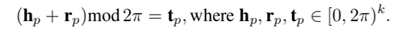
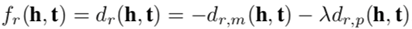

# 机器学习课程报告

## 环境搭建和前期准备

### 背景知识

**1. 知识图谱嵌入（Knowledge Graph Embedding, KGE）：**

知识图谱嵌入旨在将**知识图谱中的实体和关系**映射到**低维连续向量空间**，使得这些向量能够支持一系列推理任务，如链接预测、知识图谱补全、实体匹配等。通过将实体与关系表示为向量，可以在向量空间中捕捉实体之间的结构关系，促进推理和检索过程。

**2. 知识图谱嵌入模型的分类：**

* 基于规则的模型（如TransE、DistMult、ComplEx等）：

  这些模型通常通过一种**基于规则的机制**来进行三元组补全。TransE模型是一种典型的规则模型，它通过在实体与关系之间进行简单的矢量平移来实现三元组的推断，即 entity(h) + relation(r) ≈ entity(t)。这种方法适用于简单且线性关系，但在处理复杂的层次结构或多边形关系时表现较弱。
* 基于注意力机制的模型（如BERT-KG、ConvE、R-GCN等）：

  这些模型引入了**深度神经网络和注意力机制**，能够更有效地建模复杂关系和多层次结构。与TransE模型不同，这些方法关注不同关系的不同影响，能够捕捉到实体之间更加复杂的关系。

**3. HAKE模型的背景与特点：**

* 超球几何和注意力机制：

  HAKE（Hyperbolic Attentive Knowledge Embedding）模型利用**超球几何**来建模知识图谱中的层次结构。超球空间在处理图形结构时，能够有效捕捉实体之间的层次关系，而不是简单地平移实体和关系向量;提供了一种更自然地表达层次结构的方式，这在许多真实世界的知识图谱中，实体和关系往往具有层次化的特性。例如，实体可以表示为超球空间中的点，关系可以表示为超球空间中的边。通过引入注意机制，HAKE能够动态地关注不同层次关系的影响，从而在模型性能上有所提升。
* 层次结构建模：

  在HAKE中，层次结构的表示不仅依赖于单一关系的简单推断，而是通过注意机制来**动态调节**不同关系的影响力，进而改善模型在层次化知识图谱中的表现。这使得HAKE模型能够更有效地捕捉实体之间的多边形关系以及它们在不同层次上的关系结构。
* 挑战与计算复杂性：

  尽管HAKE在处理层次结构时表现优越，但由于超球几何和注意机制的引入，其计算复杂性可能会增加。这在处理大规模知识图谱时可能会限制模型的效率和扩展性。

### HAKE模型核心思想

HAKE的**核心思想是**利用极坐标系统来表示知识图中的实体，以便更好地捕捉和表示实体间的语义层次关系。在极坐标系统中，每个点的位置由两个坐标决定：半径（模）和角度（相位）。

HAKE模型借鉴这一概念，将实体映射到极坐标系统中。其中径向坐标代表实体在层次结构中的“深度”。在HAKE中，较小的半径表示实体位于层次结构的较高层级，而较大的半径表示较低层级。角度坐标用于区分位于同一层次结构层级的实体。即使两个实体的径向坐标相同，它们也可以通过不同的角度来区分。

这种表示方法使得HAKE能够自然地模拟知识图中的语义层次，因为层次结构可以被视为一种树状结构，其中父节点（较高层级）通过径向坐标的减小来表示，而子节点则通过增加径向坐标来表示。

### HAKE模型与类似模型的比较分析：

**1. BERT-KG (BERT for Knowledge Graphs)**

BERT-KG是基于BERT预训练模型的知识图谱嵌入方法，其核心思想是将BERT的深层语义表示能力扩展到知识图谱中，通过大量的文本信息来增强实体和关系的表征能力。

BERT-KG依赖于自注意机制来捕捉实体间的语义关联，使其能够在处理复杂关系时有效地挖掘重要的上下文信息，从而提升表征能力，主要侧重于文本丰富的知识图谱，例如文献知识图谱，在处理文本关系和实体间的语义语境方面表现突出。

**2. JOIE (Joint Learning for Knowledge Graph Embedding)**

JOIE是基于联合学习机制的KGE方法，其核心思想在于同时优化实体和关系向量，从而更好地捕捉实体间的交互和关联性。与BERT-KG不同，JOIE主要依赖于深度学习框架，特别关注层次化结构和复杂关系建模，适用于数据集稀疏性较高的多关系图谱。JOIE通过联合学习策略，可以更有效地处理复杂关系挖掘任务，在稀疏图上表现优势。JOIE并不局限于文本上下文，而是利用深度神经网络的强大表达能力来建模关系和层次结构。

**3. HRFN (Hierarchical Relation-aware Factorization Network)**

HRFN是一种基于层次关系因子分解的KGE方法，其核心在于通过层次结构捕捉复杂关系的结构。HRFN专注于多边形关系建模，通过因子分解来增强关系表征，从而处理复杂的层次结构。与BERT-KG不同，HRFN更加关注于关系增强和因子分解的技术，而不是主要依赖于语言模型和上下文信息。HRFN在处理稀疏和复杂关系建模方面有显著优势，尤其是在多边形关系的挖掘中表现突出，更依赖于因子分解的方法来捕捉层次结构，聚焦于数学模型的分解和关系增强。

**4. TKRL (Transductive Knowledge Representation Learning)**

TKRL是一种强调利用拓扑结构和邻接关系来学习知识图谱表示的方法。与BERT-KG不同，TKRL侧重于无标数据中通过邻近关系进行实体间推断，依赖于图卷积网络（GCN）来捕捉实体间的结构特性。TKRL特别适合于处理大规模知识图谱，能够在结构化数据中挖掘实体间复杂的关系。与HAKE相比，TKRL更多依赖于图卷积网络来建模实体间的拓扑结构，更侧重于图结构。

### HAKE模型算法

#### **数据处理和预处理**

**1. 数据来源：**

用于HAKE模型的典型数据集包括：

* **WN18RR** ：WordNet数据集，包含关系预测任务。
* **FB15k-237** ：Freebase数据集，包含15,000个实体和237种关系。
* **YAGO3-10** ：YAGO的扩展数据集，专注于大规模的层次化知识图谱。

**2. 数据处理流程**

程序的数据处理由 DataReader、TrainDataset 和 TestDataset 三部分完成，分别负责数据加载、训练数据预处理以及验证/测试数据预处理。

首先，DataReader 从文件中加载实体和关系字典，并将训练集、验证集和测试集的三元组数据映射为整数 ID。通过读取文件中每一行的 (head, relation, tail)，借助字典将实体和关系名称转换为对应的 ID，存储为列表形式供后续处理使用。

在训练数据处理中，TrainDataset 通过读取训练三元组，预先统计 (head, relation) 和 (tail, relation) 对应的尾实体和头实体集合及其频次，用于生成负样本和计算采样权重。每个三元组作为正样本，并根据批次类型（替换头实体或尾实体）生成负样本。通过随机替换并过滤已存在的正样本，确保生成的负样本有效。同时，采样权重根据频次平滑计算，用于降低高频样本对模型的影响。

在验证和测试阶段，TestDataset 从验证集或测试集三元组中逐一处理样本。通过构建包含所有正样本的集合，快速筛选负样本并标记正负样本类型。对每个三元组，根据批次类型替换头实体或尾实体，生成候选样本及过滤标记，用于评估模型的预测能力。

最后，通过 PyTorch 的 DataLoader 将样本批量化，并利用 BidirectionalOneShotIterator 在训练过程中交替使用替换头实体和尾实体的样本，确保模型能同时学习这两种预测任务。整个流程通过矢量化和预处理优化，实现了高效的大规模知识图谱处理和训练支持。

HAKE由两部分组成：模部分和相部分，分别针对两个不同类别的实体进行建模。为了区分不同部分的嵌入，我们用$e_m$(e可以是h或t）和$r_m$表示模部分的实体嵌入和关系嵌入，用$e_p$和$r_p$表示相部分中的实体嵌入和关系嵌入。

#### 模型算法处理流程

* 模部分
模部分旨在为层次结构的不同level上的实体建模。受具有层次属性的实体可以看作树这一事实的启发，我们可以使用节点（实体）的深度来建模层次结构的不同level。因此，我们使用模信息来建模类别（a）中的实体，因为模可以反映树的深度。具体的，本文把h_m和的t_m每个元素（也就是$[h_m]_i$和$[t_m]_i$）视为一个模量，把$r_m$的每个元素$[r_m]_i$作为两个模量之间的缩放变换，模部分的公式就可以这样定义：

对应的距离函数是：

允许实体嵌入包含负值，限制关系嵌入的元素只能为正。这是因为实体嵌入的符号可以帮助我们预测两个实体之间是否存在关系。例如，如果h和t1之间存在关系r，而h和t2之间没有关系，则$（h，r，t_1）$是正样本，$（h，r，t_2）$是负样本。本文的目标是最小化?$d_r (h_m,t_(1,m))$并最大化$d_r (h_m,t_(2,m))$，以便区分正负两类样本。对于正样本，$[h]_i$和$[t_1]_i$往往是符号相同的，就像$[r_m]_i$一样是大于0的。对于负样本，如果我们随机初始化符号的话，$[h_m]_i$和$[t_(2,m)]_i$的符号可以是不同的。这样的话，$d_r (h_m,t_(2,m))$更可能会比$d_r (h_m,t_(1,m))$大一些，正好是我们想要的效果。
此外，我们可以期望层次结构中较高level的实体具有较小的模数，因为这些实体更接近树的根。如果我们只使用模部分嵌入知识图，那么类别（b）中的实体将具有相同的模。此外，假设r是一个反映相同语义层次的关系，那么[r]_i将趋向于1，因为对于所有的h有$h°r°r=h$所以，类别（b）中的实体嵌入趋于相同，这就难以区分这些实体。因此，需要一个新的模块来对类别（b）中的实体进行建模。
* 相位部分
相位部分的目的是在语义层次的同一level上对实体进行建模。受同一个圆上的点（即具有相同的模）可以具有不同的相位这一事实的启发，我们使用相位信息来区分类别（b）中的实体。具体的，我们把$h_p$和$t_p$的每个元素，也就是$[h_p]_i$和$[t_p]_i$作为一个相位，把$[r_p]_i$作为一个相位变换。相位部分的公式就可以这样定义：

对应的距离函数是：

$sin()$是对输入向量的正弦函数的操作。
结合模部分和相位部分，HAKE将实体映射到极坐标系中，其中径向坐标和角坐标分别对应于模部分和相位部分。也就是说，HAKE把一个实体h映射为$[h_m;h_p]$，$h_m$和$h_p$分别由模部分和相位部分生成,然后拼接在一起。显然，$([h_m ]_i,[h_p ]_i )$是极坐标系中一个2D的点坐标。具体把HAKE公式定义如下：

HAKE的距离函数是：

是模型学习的参数。相应的得分函数为：
8
但两个实体有相同的模，模部分的距离为0.相位部分的可能非常大。通过结合模部分和阶段部分，HAKE可以对类别（a）和类别（b）中的实体进行建模。因此，HAKE可以对知识图的语义层次进行建模。
在评估模型时，作者发现在$d_(r,m)$ $(h,t)$中加入混合偏差(mixture bias)有助于提高HAKE的性能。修正的$d_(r,m)$ (h,t)由下式得出：

其中是-r_m^'<r_m<1和r_m维度相同的向量。其中/表示元素级别的除法操作。
* 损失函数

为了训练模型，作者使用负采样损失函数和自我对抗训练：

γ是一个固定的margin，$σ$是sigmoid函数，$(h_i^',r,t_i^')$是第i个负样本。另外，采样的负三元组的概率分布：

### HAKE模型架构、训练与评估

1. 模型架构

HAKE模型利用极坐标系统，将知识图谱中的实体嵌入到径向和角度坐标中。径向坐标用于表示实体的层次深度，较小的径向值对应较高层级，较大的径向值对应较低层级。角度坐标用于区分同一层级中的实体，确保即使径向相同的实体也能通过角度信息被区分开来。

实体嵌入：每个实体被映射到一个高维空间中的点，这个点在极坐标系统中由一个模向量和一个相位向量表示。
关系嵌入：每个关系也被映射到高维空间中，用于模拟实体间的相互作用。在HAKE中，关系嵌入包括模变换和相位变换两部分。
模部分：通过模向量的乘法来模拟实体间的层次关系。如果两个实体通过一个关系相连，那么它们在模空间中的表示应该满足一定的数学关系。
相位部分：通过相位向量的加法来模拟同一层级实体间的差异。这允许模型区分具有相同模但不同相位的实体。
距离函数：HAKE定义了一个距离函数来衡量实体间的相似性，该函数结合了模距离和相位距离。
损失函数：模型使用负采样损失函数和自对抗训练来优化实体和关系的嵌入，以提高链接预测的准确性。

2. 训练过程

HAKE通过优化排名损失函数，使正样本得分高于负样本得分。

训练过程包括以下关键步骤：

从知识图谱中加载正样本三元组。

利用负采样生成负样本。

计算正负样本的得分，更新模型参数（采用Adam优化器）。

3. 评估方法

指标：使用Mean Rank、Mean Reciprocal Rank和Hit@K评估模型性能。

流程：对测试三元组的候选尾实体进行得分计算和排序，统计排名指标并计算平均值。

### HAKE模型局限性

**1. 计算复杂度高**
   HAKE模型通过引入层次信息增强了知识图谱的嵌入表示能力。然而，这种增强也带来了计算复杂度的显著提高。在模型训练过程中，层次信息的融入需要处理更多复杂数据，尤其是在大规模知识图谱（如包含数百万三元组）上，训练时间和内存消耗会显著增加。对于这些大规模图谱，HAKE的计算和扩展能力面临巨大挑战，模型难以快速适应实际应用需求。

**2. 层次信息的稀缺性与不准确性**
   层次信息是HAKE模型的核心之一，但知识图谱中并非总能提供明确的层次结构。例如，在开放领域知识图谱中，层次关系可能隐含在实体和关系的特征中，或者存在显著噪声。当层次信息不完备或含有错误时，模型可能会学习到错误的层次依赖，导致性能下降。此外，如何高效地从数据中挖掘层次信息仍是重要的技术挑战。

**3. 泛化能力问题**
   HAKE模型的层次嵌入方法设计上更适用于具有明显层次结构的领域，例如生物医学或语义网。然而，对于无显著层次特征的知识图谱（如社交网络），HAKE难以完全发挥其优势。此外，不同领域的知识图谱可能存在显著差异，导致模型迁移能力和适应性不足，需要在模型调参和优化上投入额外精力。

**4. 训练策略与优化问题**
   HAKE采用了传统的负采样策略，即通过随机替换三元组中的头实体或尾实体生成负样本。然而，这种方法容易产生不相关或冗余的负样本，无法有效利用层次信息，影响训练质量。同时，层次信息的融合机制虽然创新，但当前的优化方法仍然较为初级，未能充分挖掘层次结构的潜力。

### HAKE模型改进方向
1. 正则化方法
- L1/L2 正则化
L1正则化通过在损失函数中添加绝对值项，可以促使模型学习到更稀疏的权重，有助于减少过拟合。L2正则化通过在损失函数中添加平方项，可以限制模型参数的大小，同样有助于减少过拟合。
- dropout
在模型训练过程中随机丢弃一部分神经元，可以防止模型对训练数据过拟合。
- 权重衰减
类似于L2正则化，通过在优化过程中对权重施加衰减，限制模型参数的增长，减少过拟合。
2. 优化技巧
Adam优化器：Adam是一种自适应学习率优化算法，它结合了RMSprop和Momentum两种优化算法的优点，通常能够更快地收敛。
学习率衰减：随着训练的进行，逐渐减小学习率，可以帮助模型在训练后期更细致地逼近最优解。
梯度裁剪：当梯度爆炸时，通过限制梯度的大小，可以防止梯度更新过大导致的问题。
早停法：在训练过程中，如果验证集上的性能不再提升，提前终止训练，避免过拟合。
3. 高级优化策略
超参数优化：使用网格搜索（Grid Search）或随机搜索（Random Search）等方法来寻找最优的超参数组合。
学习率预热：在训练初期，逐渐增加学习率，帮助模型更快地逃离局部最优。
4. 模型架构改进
残差连接：在模型中引入残差连接，可以帮助信息在深层网络中流动，缓解梯度消失问题。
批量归一化：对输入进行归一化处理，可以加快训练速度并提高模型稳定性。
注意力机制：在模型中引入注意力机制，可以帮助模型更加关注重要的信息。
5. 数据增强
数据增强：通过对训练数据进行变换（如实体替换、关系替换等），增加数据的多样性，提高模型的泛化能力。
对抗训练：通过生成对抗样本来训练模型，增强模型对噪声和异常值的鲁棒性。

1. 算法优化方向

- 引入更加智能的负样本生成策略
- HAKE模型当前主要依赖随机替换三元组中的头实体或尾实体生成负样本。然而，这种方法容易产生无效或冗余的负样本，无法充分挖掘层次信息的特性。改进方向可以包括：
  基于层次距离的负采样：通过计算实体在层次结构中的相对位置，为负样本生成引入层次感知的加权机制。与目标实体距离较远的负样本被赋予更高的权重，从而提高模型对负样本的区分能力。
  对比学习的引入：通过对比学习方法，生成更具挑战性的负样本，使模型能够学习到更显著的层次间特征差异。这种方法有助于提升嵌入的区分性和泛化能力。
- 优化层次嵌入的建模方式
- 目前，HAKE使用简单的极坐标系统表示层次信息，径向表示层次深度，角度用于区分同层次实体。虽然这种方法直观，但在捕捉复杂层次关系时可能表现不足。
  结合图卷积网络（GCN）：利用GCN建模知识图谱的局部结构特征，通过消息传递机制学习实体的层次嵌入，使模型能够更精准地反映实体间的层次关系。
  引入多维度层次信息：扩展当前的层次嵌入设计，将不同层次关系（如父子关系、平级关系）分开建模，通过独立的子嵌入进一步强化模型的表达能力。
- 增强模型正则化
- HAKE模型为了避免过拟合，目前主要依赖L2正则化。进一步的改进可以包括：
  Dropout机制：在层次嵌入和实体嵌入的学习过程中随机丢弃一部分特征，使模型避免过于依赖某些特定特征，增强其泛化能力。
  早停策略：在训练过程中通过验证集监控模型性能，自动停止过拟合的训练过程，保证模型的稳定性和鲁棒性。
- 优化训练目标
- HAKE的训练目标是使正样本得分高于负样本，但当前的损失函数可能未充分利用层次信息。改进建议包括：
  层次感知损失函数：在传统排名损失基础上加入层次结构的软约束条件，例如，要求同一层次的实体嵌入在向量空间中更接近，而不同层次的实体之间保持适当的距离。
  多任务学习框架：将层次关系预测任务与知识图谱嵌入任务结合，通过联合优化多个目标任务，提升模型对层次信息的敏感性。

2. 超参数优化方向

- 嵌入维度
- HAKE通过实体和关系的低维向量表示捕捉语义特征。嵌入维度的选择会显著影响模型性能：

  - 高维嵌入：增加嵌入维度（如从200提升至300）能够捕捉更复杂的特征，适用于大规模知识图谱，但可能导致训练时间增加且容易过拟合。
  - 低维嵌入：降低嵌入维度（如从200降至100）可以减少计算成本，适合小型知识图谱，但可能导致表示能力不足。
- 学习率
- 学习率决定参数更新的步长，是影响模型训练速度和收敛稳定性的关键因素：
  较高学习率：例如0.01，适合简单任务或对收敛速度要求较高的场景，但可能导致收敛不稳定。
  较低学习率：例如0.0001，更适合复杂任务或需要精细优化的模型，虽然收敛速度较慢，但能提升稳定性和性能。
- 负采样数量
- 负采样数量直接影响训练的效率与效果：
  较低负采样数：例如1-5个负样本，适合资源受限的场景，但可能导致模型对负样本的区分能力不足。
  较高负采样数：例如10-50个负样本，能够提升训练样本的多样性，帮助模型学习更细致的特征，但需要更多计算资源。
- 批量大小
- 批量大小影响每次参数更新所需的数据量：

  - 小批量（如32-64）：适合内存受限的场景，能够提供更细粒度的梯度更新，但训练时间更长。
  - 大批量（如128-256）：加速计算，适合拥有充足计算资源的场景，但可能降低模型的泛化能力。
- 层次嵌入维度
- 层次嵌入维度决定了模型对层次信息的表达能力：

  - 低维层次嵌入（如10-20）：适合层次结构简单或训练数据较少的知识图谱。
  - 高维层次嵌入（如50-100）：适合层次结构复杂的场景，能够捕捉更细致的层次关系特征，但可能导致过拟合风险增加。
- 正则化强度
  正则化可以帮助防止过拟合：
  较强正则化：通过较高的L2正则化系数或Dropout概率（如0.5），适合小型数据集或模型复杂的场景。
  较弱正则化：通过较低的正则化系数或Dropout概率（如0.1），适合大型数据集或模型较简单的场景。
- 超参数选择方法

  - 网格搜索：系统地尝试每个超参数组合，适合小规模实验。
  - 随机搜索：在超参数空间中随机选择组合，计算成本低，效果接近网格搜索。
  - 贝叶斯优化：根据先前实验结果预测最优超参数组合，在计算资源有限时效果尤为显著。
  - 交叉验证：在验证集上进行多轮训练，确保超参数选择具有鲁棒性和稳定性。
3. 数据优化方向
   1. 数据集选择问题与改进建议：
    - 引入多模态知识图谱数据集：包含文本、图像、视频等多模态信息的知识图谱数据集（Visual Genome/ConceptNet），扩展模型的输入维度，提升对丰富上下文信息的理解能力。
   - 扩展数据集涵盖的领域：探索跨语言、多领域或行业特定的数据集（医学知识图谱或者法律知识图谱等），让模型在更广泛的场景中得到验证。
   1. 数据增强方法：
当前模型在训练过程中仅依赖随机生成的负样本，可能导致负样本质量较低，限制了模型对复杂关系的学习，而且可能对稀有关系和长尾实体的学习不足，影响了整体的泛化能力。
    - 生成高质量的负样本：使用基于模型预测的负样本生成策略，例如，使用预训练模型生成最有可能被误分类的负样本（难负样本）。这可以用动态负采样策略实现，提高训练样本的难度；利用图结构信息生成负样本，考虑与正样本中节点相邻的实体作为负样本，确保负样本更加具有挑战性。
    - 增强稀有关系：对低频关系和实体进行过采样或使用数据补全方法（基于规则的推理或图神经网络预测缺失的关系）；对低频关系样本生成多种增强版本，比如语义替换、随机扰动或邻域采样。
   2. 实验设置：
    - 为了更全面地评估模型能力，可以引入多样化的评估指标，不仅局限于 Hits@k 和 MRR，还可以通过实体分类任务测试模型对实体嵌入信息的表达能力。路径预测可以用来检验模型对多跳关系的推理能力，而多关系查询则能测试模型在处理多重关系约束时的表现。这些额外的评估方式能够全面反映模型在实际场景中的适用性。
    - 在负采样策略上，可以设置不同的负采样比例和难度分布，观察对模型训练效率和性能的影响。合理调整负样本的数量和选择机制能够帮助模型更有效地区分正负样本，避免因负样本过于简单或复杂导致的训练不足或过拟合问题。
    - 为了评估模型对数据噪声的鲁棒性，可以在实验中引入随机噪声或不完整数据。通过添加噪声数据或移除部分关系，考察模型在不完美数据上的表现。这种测试方法有助于验证模型在面对实际应用场景中常见数据问题时的稳定性和可靠性。
