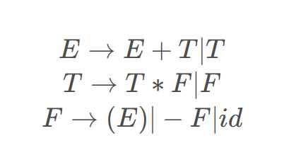

# 概念题

role：和上下文的关系（可以说到analyse synsasis什么的）谁提供给他的 他为谁服务

task：他做了什么

多看书

interpreter is  portable

构造LR(1)项目集规范族的方法本质上和构造LR(0)项目集规范族的方法是一样的,只需要修改closure函数和goto函数。也就是LR(1)项目集在进行产生式归约时，只前看一个符号，也就是FOLLOW集中的第一个符号，若下一个符号与之匹配才进行归约。

什么是自上而下(Top-down)

- 从文法的开始符号出发,反复使用各种产生式,寻找"匹配"的推导
- 推导:根据文法的产生式规则，把串中出现的产生式的左部符号替换成右部
- 从树的根开始,构造语法树
- 递归下降分析法、预测分析程序

什么是自下而上(Bottom-up)

- 从输入串开始,逐步进行归约,直到文法的开始符号
- 归约:根据文法的产生式规则,把串中出现的产生式的右部替换成左部符号
- 从树叶节点开始,构造语法树
- 算符优先分析法、LR分析法

句柄(handle)是该句型中和一个产生式右部匹配的子串,并且,把它归约成该产生式左部的非终结符代表了最右推导过程的逆过程中的一步。correct derivation and after the derivation can produce correct results

environment: link name and address

state: link value and address

bottom-up可以发现error

grammar:

- 0-type: There is at least one non-terminal in α
- 1-type: context sensitive
- 2-type: CFG
- 3-type: regular grammar

SLR: LR0的items，遇到等号左侧非终结符的follow做reduction

LALR: 对LR1的结果的相同core的做合并

如果没有global value就没有这部分了

# role&tasks

scanner：

- role:
- the first step of a compiler
- input sentences and output sequence of tokens and symbol table
- called by parser
- tasks:
- scanning
- buffering
- token identifying/lexical analysis&error message

parser:

- role:
- input symbol table and output parsing tree
- tasks:
- analyse sentencial form and handle the errors

semantics:

- role:
- syntax directed semantic analysis:
- semantic analysis called by parser
- syntax rules are attached by semantic rules
- the using of syntax rules may attribute semantic rules
- annotated parse tree

# language→grammar with ε-free productions  

规定起点/终点：在S后面加起点/在终态后面加终点（记得添加之后还有新的状态指向别的字母）

电路图法：终态需要推导出`ε`/记得在图上标出来两个圈

规定奇数偶数：设置0和1分别代表某个字母的个数

规定字母出现与否：一步一步从起点推

注意如果S->ε而且S出现在右侧，就要加入新的S‘然后带入S并去掉ε

# construct miniDFA

可以先标注一下每个状态一开始的元素，和闭包分开，比较好写

记得画起始S之前的箭头还有最后状态的双圈（标成x和y比较方便之后mini）

如果a/b比较少，写出来a/b的转换前后的状态数字，然后直接根据式子里有的数写出转化后的数

↑可以用式子里a/b的个数检验有没有写全

mini的时候空集怎么办？单拎出来到一个组里

# LL(1) parsing table

有左公共因子的话一定不是LL(1)

先消除左递归再消除左公因子

消除左递归：

- 一定要注意T'会等于ε（每次都忘记）

- 顺序一定是按照规定的顺序来看，然后一个一个看字母，先看有没有违背顺序，再看直接左递归
- 要消除dead production

消除左公共因子：

- 先让H'=左公共因子 H，然后再写H后面的

构造LL(1)表：

- 先构建first和follow集合（按照每个因子在左边/右边分别来看）
- 然后根据每个非终结符的first来填表，如果是ε就把ε产生式填到follow的符号的格子里
- 如果一个格子出现多个式子，说明不是LL(1)文法

start symbol的follow要加$

# LR(1)

注意一开始就要提取所有的闭包！考虑好下一个字母的first！

分号有左结合：

- 当reduction和shift矛盾的时候，如果是典型的左结合场景，就reduction

- 如果是if S·还有S·;S，用shift（这个是我们规定的，因为默认句子末尾是分号）其实根据已有条件仍然存在冲突

关于算符优先级：

- 把**优先级高的看成乘法**，优先级低的看成加法
- 

# annotated parse tree

作业题太简单了没有参考性

先画 parsing tree，再逐节点改成 semantic rule

# the run-time stack map

注意看活动记录第几次达到最多

activation tree：函数调用的顺序/代码运行顺序

# quadruple sequence

题目没有说用四元组的话可以直接用三地址码进行回填

对于数组的话如果是\[0...10][0...10]就直接用a的地址

如果是\[1...10][1...10]就要减去一行一列的地址来计算首地址，给首地址赋临时值

注意循环结束也要goto

注意有几次a\[i,j]就写几次一堆t的赋值（只有优化部分会减去后面的赋值）

地址的-11可以直接写

四元组形式的jump：先一组判断成立：（j==，0，loop，6）再（j，\_，\_，0）

赋值是要（=，1，\_，n）

# DAG optimization

没有用到的就不排序

排序应该是从左到右的子孩子排

3 types of optimization

- source code level
- intermedia code analysis
- machine code/target code

constant folding

# SDT/SDD

可能会出个计数a位置的题目？

S-SDD：

仅仅使用综合属性

L-SDD：

属性必须是从它左边兄弟节点或者父节点中的属性推导出来的

把S-SDD转换为SDT：

把每个语义规则都放在产生式右面的最后，在LR文法中执行规约的时候执行动作（在栈里加一列，支持存多个属性）

把L-SDD转换为SDT：

把计算继承属性的动作插入到产生式右部中紧靠A的本次出现**之前**（也就是左边）的位置上

把计算综合属性的动作插入到最右边

# 消除二义性

- 将最低优先级的运算提至第一层产生式
- 最后一层上的各层产生式添加′ ∣ ′ 
- 单独推导向下一层
- 其余按照优先级高低逐层向下写
- 使用新的非终结符代替原终结符
- 最后一层产生式要能够推回第一层产生式

# else

~~什么之后要消除死句子来着（消除ε）：消除左递归~~

看概念题

~~看sdt~~

LL1的使用

caller和collee的责任

~~中间代码生成+bool 回溯~~

看看两份笔记
