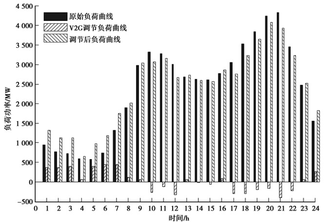
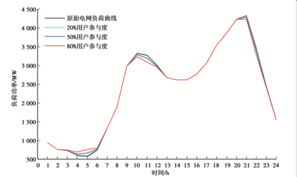
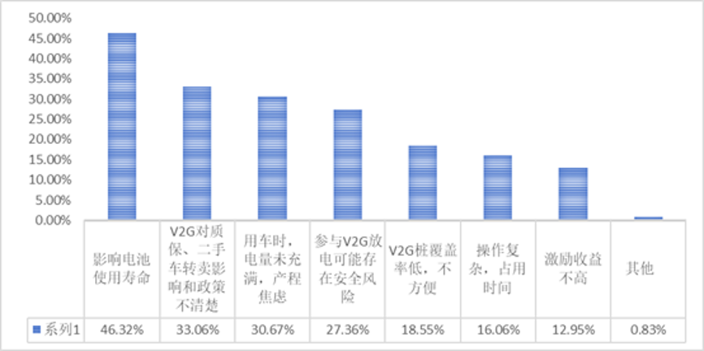
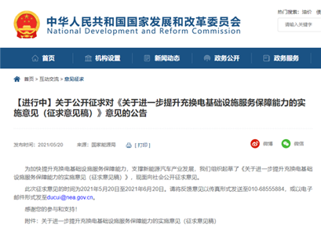
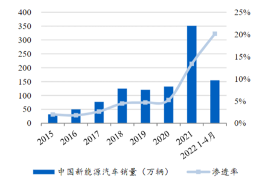
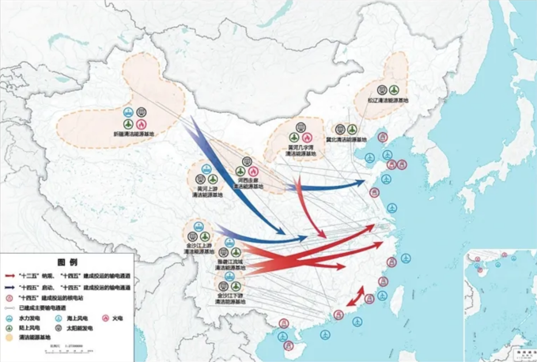

## V2G 技术的作用与优势
### 平抑负荷峰谷
V2G 技术的核心原理是巧妙地利用电动汽车的闲置时间，将其转化为电网的分布式移动储能单元。在深夜至清晨的负荷低谷期，电网电力供应充足且电价较低，此时电动汽车接入电网充电，就像一个个小型的 “电力海绵”，吸纳电网中的多余电量；而在白天的用电高峰时段，尤其是夏季傍晚空调等大功率电器集中使用时，电动汽车通过逆变装置将储存的电能回馈给电网，为电网输送急需的电力。以某大型城市为例，在实施 V2G 项目后，电网的峰谷差得到了显著的缩小。

通过对实际负荷曲线的分析可以发现，原始负荷曲线在 01:00 - 07:00 期间处于负荷低估期，而在 09:00 - 13:00 和 18:00 - 22:00 分别出现了两个明显的负荷高峰。但在电动汽车的 V2G 调节作用下，负荷高峰期电动汽车放电，低谷期充电，调节后的电网负荷曲线与原始曲线相比有了脱胎换骨的变化。调节后的负荷曲线最大值为 4053MW，平均负荷 2416MW，负荷率为 0.596；而原始负荷曲线最大值为 4328MW，平均负荷 2388MW，负荷率为 0.552。这表明电动汽车与电网的互动有效地增大了电网侧的负荷率，使电网负荷曲线更加平滑，极大地缓解了因峰谷差过大给电网带来的压力与运行风险，减少了为满足短时高峰负荷而过度建设发电容量的需求，提高了整个电力系统的资产利用率。
### 增加电动车辆使用
在电动汽车发展中，出租网约车已基本实现全面电动化，但工作日靠公交、周末才用车的私家车主因年行驶里程低，电动汽车在经济性上难胜燃油车，且充电便捷性差，据统计北京 2019 年约 40% 私家车年行驶里程低于 1 万公里。要吸引这部分用户，关键在于将其车辆的移动储能价值变现，可通过加快 V2G 技术研发应用与基础设施建设、完善市场机制与政策引导等，提升电动汽车在私家车主市场的竞争力，促进其普及。

### 规模效应与预测
根据权威机构中国汽车工程学会的预测，到 2030 年中国电动汽车保有量将有望达到 8000 万辆的庞大规模。若平均每辆电动汽车配置 60 千瓦时电池，那么 8000 万辆电动汽车的等效储能容量将高达 48 亿千瓦时。这是一个极其可观的数字，相当于一座巨型的移动储能电站。进一步测算可知，届时全年电动汽车用电需求将达 7454 亿千瓦时，占社会总需求的 6 - 7%；充电功率 1.94 亿千瓦时，占电网负荷的 11 - 12%。如此巨大的储能和用电规模，将为电网的调峰调频提供强大的支撑力量。在风能、太阳能等可再生能源发电不稳定的情况下，电动汽车可以利用其储能功能，在可再生能源发电过剩时充电储存，在发电不足时放电补充，有效促进可再生能源的消纳，推动能源结构向绿色低碳转型。
## 实现三方共赢
- 对电网：V2G 技术赋予了电网对电动汽车充电和放电时间的精准调控能力，如同给电网安装了一个智能调节阀。在电网负荷高峰期间，通过合理控制充电桩 V2G 系统的运行，引导电动汽车放电，能够有效地减轻电网的供电压力，平衡电网的供需关系。例如，在炎热的夏季用电高峰期，大量电动汽车向电网放电，可以缓解空调等电器用电对电网的冲击。这不仅减少了因电动汽车大量发展带来的用电压力，还能提高电网的运行效率和可靠性。同时，由于电动汽车的储能作用，电网在储能建设方面的投资也得以大幅减少，优化了电网的资源配置，增强了电网对大规模电动汽车接入的适应能力，为电网的可持续发展奠定了坚实基础。
- 对车企：对于汽车制造商而言，V2G 技术是推动电动汽车市场发展的有力助推器。它使用户能够在使用电动汽车的过程中有效降低成本，提高了电动汽车的性价比。例如，车主可以通过参与 V2G 获得经济收益，从而减少了购车和用车的总成本，这将吸引更多消费者选择电动汽车。在紧急情况下，如自然灾害导致电网停电时，具有电力输出功能的电动汽车可以当作紧急电源使用，为用户提供应急电力保障，进一步提升了电动汽车的实用性和吸引力。这些优势将促进电动汽车的生产与销售，激励车企加大研发投入，不断提升电动汽车的性能和质量，推动电动汽车产业的快速发展。
- 对新能源车主：对于电动汽车车主来说，V2G 技术带来了实实在在的经济利益。在电网负荷低、电价处于低谷的时候，车主可以从容地给车辆充电，享受较低的充电成本。而当电网负荷高、电价上涨时，车主则可以通过充电桩 V2G 技术，将车辆存储的能量出售给电网公司，实现 “卖电赚钱”。以上海为例，峰谷电价每度相差 0.35 元，如果一辆车每天放电 20 度，每月参与 20 次放电活动，那么车主每月可为自己带来至少 0.35×20×20 = 140 元的收益（政府补贴尚未计算在内）。这种经济激励机制将促使更多车主积极参与 V2G 项目，形成车主与电网之间的良性互动。
## V2G 技术面临的问题
### 参与度低

- 消费者角度：在消费者层面，对 V2G 技术的担忧主要集中在电池寿命和安全性方面。他们担心频繁的充放电操作会加速电池的老化，缩短电池的使用寿命，增加更换电池的成本。同时，他们也害怕电池在放电过程中可能会出现过热、短路等安全问题，危及自身和车辆的安全。而目前 V2G 收益的不确定性使得消费者认为其难以有效覆盖电池寿命和安全性下降带来的潜在损失，因此对参与 V2G 项目持谨慎态度，参与积极性较低。
- 
- 车企角度：当前市场上，消费者对具有 V2G 功能的车型需求极为低迷，这使得车企在研发和生产 V2G 车型时面临巨大的市场风险。开发 V2G 车型不仅需要对汽车的硬件进行升级，如改进车载充电机等设备，还需要投入大量资源进行软件优化，以确保车辆在 V2G 模式下的稳定运行。这些研发和生产成本的增加，加之回报路径不明确，使得车企在 V2G 技术的投入上犹豫不决，缺乏积极开发 V2G 车型和设计配套营销和质保方案的动力。
- 充电运营商角度：充电运营商在 V2G 技术推广过程中也面临着诸多困境。首先，V2G 的盈利模式尚不明晰，目前主要依靠峰谷价差套利，但这种收益方式受限于多种因素，如电价政策、市场需求等，收益不稳定且微薄。其次，充电桩的改造和升级成本高昂，需要大量的资金投入。而且，回报周期较长，短期内难以实现经济效益，这使得充电运营商在面对 V2G 技术时望而却步，制约了 V2G 技术在充电基础设施领域的推广应用。
### 成本问题
- V2G 桩成本：目前，由于 V2G 桩尚未实现批量化生产，其生产成本居高不下。一台 15 千瓦的 V2G 桩价格高达 2 万元以上，相比之下，相同功率的常规直流桩价格仅为其 1/2 至 1/3。高昂的价格使得在建设 V2G 充电设施时，前期投入成本大幅增加，给项目的投资和运营带来了沉重的负担，严重阻碍了 V2G 桩的大规模推广应用。
- 充电桩改造与建设成本：要实现 V2G 功能，现有的充电桩需要进行大规模的改造升级，这涉及到硬件的更换和软件的重新开发调试。一方面，硬件升级需要采购新的充电模块、通信设备等，增加了硬件成本；另一方面，软件调整需要专业的技术团队进行研发和维护，耗费大量的人力和时间成本。此外，大量现有的充电桩并没有反向充电功能，若要实现 V2G 的广泛普及，前期铺设新型充电桩的成本更是一个难以逾越的难题。这不仅需要大量的资金投入，还需要解决充电桩的选址、安装、维护等一系列问题，使得充电桩改造与建设成为 V2G 技术推广的关键瓶颈之一。
- 换电站建设成本：V2G 换电站的建设成本堪称天文数字。一个换电站裸站成本在 300 - 500 万元（不含电池），电池按 50 度 / 块计算，成本在 6 万元左右。若满配 26 - 60 套电池，电池成本将达到 150 - 360 万元，整站的成本更是高达 450 - 860 万元，这还不包括建设和增容费用。在一个城市中，如果要形成规模化的换电站网络，初期就需要建设十几甚至数十座换电站，如此巨大的投资额让许多企业和投资者望而却步，成为 V2G 换电站建设发展的巨大障碍。
- 电网升级成本：V2G 技术的实施要求电网具备双向能量流动的能力，这就需要对电网进行全面的升级改造。包括升级变电站的设备、优化电网的通信和控制系统、增强电网的调度能力等。这些升级工作需要大量的资金、技术和人力投入，给电网企业带来了巨大的经济压力。而且，电网升级改造涉及到多个环节和部门的协调配合，工程复杂，实施难度大，进一步增加了 V2G 技术推广的难度。
### 电网安全性
- 电网连接与监测需求：为了实现 V2G 技术与电网的有效融合，国家电网需要将主配网与柔性负荷、分布式发电、分布式储能等用户侧智能设备进行紧密连接，构建一个面向用户的智慧能源控制与服务体系。这一过程需要解决设备之间的兼容性、通信协议的标准化等问题，确保设备能够与电网实现良性互动。同时，为了更好地把控电动车放电量与电网需求量的供需关系，V2G 还要求电网能够实时监测系统缺电情况，及时发布响应请求。这需要电网安装大量的监测设备，建立高效的数据传输和处理系统，对电网的智能化水平提出了极高的要求。
- 功率返送冲击：V2G 的大规模功率返送是一把双刃剑，在带来能源调节便利的同时，也给电网安全带来了巨大的挑战。在电压等级较低的配电网区域，如常见的 10 千伏及以下的配电网，虽然其供电范围相对较小，电力用户类型较为多样且分散，对功率波动的容忍度相对较高，但大规模功率返送仍可能引发电压波动、谐波等问题，影响局部电网的电能质量。而对于一座城市核心的 220 千伏变电站而言，其处于电力传输和分配的关键环节，承担着为大片区域供电的重要任务，供电可靠性要求极高。一旦 V2G 出现大规模功率返送，可能会对变电站的电压、频率等关键运行参数产生较大影响，如导致电压波动超出允许范围、频率不稳定等，进而引发连锁反应，影响到整个区域电网的安全稳定运行。目前，由于电网的管理体制和传统运行方式的限制，大规模功率返送在高电压等级变电站原则上是受限的，这也成为 V2G 技术推广的重要障碍之一。
## 发展前景与机遇
- 政策支持：近年来，国家高度重视新能源汽车产业和电网的可持续发展，出台了一系列政策法规来提升充换电基础设施服务保障能力，大力支持新能源汽车产业发展。例如，《新能源汽车产业发展规划（2021 - 2035）》明确了新能源汽车的发展目标和战略方向，为 V2G 技术的发展提供了宏观政策指引；《进一步提升充换电基础设施服务保障能力的实施意见》则针对充换电基础设施建设和 V2G 技术应用中的具体问题提出了指导意见和解决方案。这些政策的出台为 V2G 技术的研发、示范和推广创造了良好的政策环境，激励企业加大在 V2G 领域的投入，推动技术创新和产业升级。

- 市场潜力：尽管 V2G 技术目前面临诸多挑战，但其市场潜力巨大。据专业机构测算，2025 年 V2G 市场空间将达到 333 亿元，到 2030 年更是有望突破 1052 亿元。这一庞大的市场规模吸引了众多企业的目光，包括汽车制造商、电网企业、能源科技公司等纷纷布局 V2G 领域。随着市场的不断发展和技术的逐步成熟，V2G 产业链将不断完善，成本有望降低，商业模式将更加清晰，为 V2G 技术的大规模应用和商业化推广奠定坚实的市场基础。

- 技术优势与制度优势：V2G 技术在消纳清洁能源方面具有独特的优势。我国风能、太阳能等可再生能源资源丰富，但由于其波动性和间歇性强，并网发电面临诸多困难。V2G 技术响应速度快，进出机制灵活，相对于固定储能装置，不需要额外投资建设大规模的储能设施，能够在消纳清洁能源多余电力方面发挥不可替代的作用。此外，我国社会主义制度具有强大的集中力量办大事的优势，电网集中度高，便于统一规划和协调管理。这有利于在全国范围内推广 V2G 技术，实现资源的优化配置，促进能源转型和可持续发展。在未来，随着技术的不断进步和政策的持续支持，V2G 技术有望实现对电网的全面支撑，助力我国实现 “碳中和” 的宏伟目标，为全球能源革命做出重要贡献。

## V2G接入后对于公共交通的影响
公共交通运营部门可以通过 V2G 接入参与电网的需求响应计划，获取经济补偿。对于资金紧张的公共交通企业来说，这部分额外收入可以用于车辆维护、更新设备等。同时，由于电网可以在一定程度上调节车辆的充电时间和充电量，使得公共交通车辆能够在电价较低的时段充电，降低了充电成本；除了作为交通工具，公共交通车辆通过 V2G 接入还可以成为一种能源资源。这使得车辆的功能得到拓展，提高了车辆的综合利用率。例如，一辆电动公交车在运营时间提供客运服务，在非运营时间则可以为电网提供能量支持，实现了车辆价值的最大化。

# 结论
综上所述，V2G 技术在应对电动汽车充电对电网的影响方面展现出了巨大的潜力和价值，但目前在用户参与、成本控制和电网安全等方面仍面临着诸多亟待解决的问题。为了实现 V2G 技术的广泛应用和可持续发展，政府、企业、科研机构等各方应紧密合作，形成合力。政府应进一步完善政策机制，加大对 V2G 技术研发和示范项目的支持力度，引导社会资本投入；企业应积极创新，降低 V2G 设备和运营成本，探索多元化的商业模式；科研机构应加强技术攻关，提高 V2G 技术的可靠性和安全性，突破关键技术瓶颈。只有通过各方的共同努力，才能推动 V2G 技术从理论研究和试点示范走向大规模商用化和产业化，实现电动汽车与电网的和谐共生，促进能源的高效利用和可持续发展，为人类社会的绿色发展和生态文明建设注入强大动力。
# 个人心得
在搜集资料与汇报的过程中，我了解到电动汽车产业的蓬勃发展在给社会带来环保与节能效益的同时，也给电网的稳定运行带来了前所未有的挑战。其充电负荷的时空随机性犹如一把双刃剑，在推动能源结构变革的同时，也使电网的峰谷差不断拉大，配电容量在某些区域尤其是老旧小区显得捉襟见肘，电能质量也因大量电动汽车的无序充电而受到不同程度的影响。传统电网的规划与运行模式在面对这一新兴的能源利用方式时，暴露出了诸多的不适应性，迫切需要创新的解决方案来应对。
而 V2G 技术的出现，无疑为解决这些难题提供了一条极具潜力的路径。在深入探究其原理和应用实践时，我逐渐理解了它的精妙之处。V2G 技术充分利用了电动汽车的闲置时段，将其转化为电网的分布式移动储能单元，实现了电能在时间和空间上的灵活调配。通过在负荷低谷期从电网吸收电能储存起来，在用电高峰期再将电能回馈给电网，有效地平衡了电网的负荷曲线，极大地提高了能源的综合利用效率。从实际的案例分析中可以看到，在一些试点地区实施 V2G 技术后，电网的负荷稳定性得到了显著提升，峰谷差明显缩小，这不仅减少了电网为应对高峰负荷而过度建设发电容量的需求，还为可再生能源的大规模接入提供了更好的消纳条件。
同时，V2G 技术所带来的三方共赢局面也给整个能源产业带来了新的发展机遇。对于电网企业而言，它能够有效缓解电动汽车大规模接入带来的用电压力，降低储能建设成本，增强电网的可靠性和灵活性；对于汽车制造商来说，V2G 功能的实现可以提升电动汽车的市场竞争力，吸引更多消费者购买，促进电动汽车产业的进一步发展；对于广大电动汽车车主，他们可以通过参与 V2G 项目在电价较低的时段充电，在电价较高的时段向电网售电，从而降低自身的用电成本，获得实实在在的经济利益。
然而，在学习过程中我也深刻认识到 V2G 技术在实际推广应用过程中面临着诸多严峻的挑战。从消费者角度来看，他们普遍担心频繁的充放电操作会加速电池的老化，影响电池的使用寿命和安全性，并且目前 V2G 项目所带来的收益在很多情况下难以有效覆盖这些潜在的风险，这使得消费者对参与 V2G 项目持谨慎态度。在企业方面，无论是汽车制造商还是充电桩运营商，都面临着较高的技术研发成本和设备改造升级成本。开发支持 V2G 功能的车型需要对汽车的硬件和软件进行全面升级，充电桩的改造也需要投入大量的资金和技术力量，而且短期内难以获得可观的经济效益，这在一定程度上抑制了企业的积极性。此外，从电网的角度出发，V2G 技术的大规模应用需要电网进行相应的升级改造，以适应双向能量流动的需求，同时还需要解决电能质量、功率控制和调度管理等一系列复杂的技术问题，确保电网的安全稳定运行。
尽管面临着诸多困难，但此次课程学习让我坚信 V2G 技术在能源互联网的发展进程中具有不可替代的重要性。它不仅是解决电动汽车与电网协调发展问题的关键技术，也是推动能源转型和可持续发展的重要力量。在今后的学习和研究中，我将持续关注 V2G 技术的发展动态，积极参与相关的学术讨论和实践活动，努力提升自己在这一领域的专业知识和技能水平。同时，我也希望能够通过自己的努力，为促进 V2G 技术的创新发展和广泛应用贡献一份力量，助力能源互联网的建设，实现能源领域的绿色、高效和可持续发展目标。