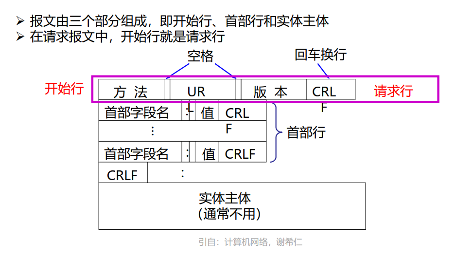

•选择题：20题（40分）

•判断题：10题（10分）

•简答题：5题（30分）

•综合题：2题（20分）

# Chapter1 计算机网络概述

## 计算机网络、Internet(构成、通信基础设施)

最基本的功能：数据通信

## 网络边缘：位置⭐，家庭接入、企业接入、广域无线接入

通信子网对应OSI下三层模型：物理层、数据链路层、网络层

区别局域网和广域网的关键是使用协议而不是覆盖范围，局域网使用广播策略，广域网使用点对点也就是交换策略

局域网接入广域网主要是通过路由器的互联设备实现

集线器：星型拓扑

局域网：数据链路层，不需要网络层，使用广播信道（也就是总线拓扑结构），不存在路由选择问题

广域网：网状拓扑，因为覆盖范围广。结点数目多

## 网络核心：位置⭐，分组交换（存储转发）⭐，电路交换，多路复用（时分、频分）⭐，电路交换和分组交换的比较，网络结构

电路交换：通过物理链路的连接动态的分配传输线路资源，需要**建立连接**，一直占用通信资源，通信结束后释放资源。

- 优点：
  - 传输速率高

- 缺点：

  - 额外的数据开销

  - 利用率低

  - 线路分配灵活度差

  - 不支持差错控制

分组交换：

- 包括虚电路方式和数据报方式

- 优点：
  - 通信前无需建立连接
  - 分组定长便于存储转发（时间开销、缓存开销小）
  - 分组不易出错
- 缺点：
  - 控制信息占比增加
  - 存储转发时延

计算时延：这是分组时延，如果忽略排队时延（那么也不考虑处理时延），只计算发送和传播，那么就是段数\*传播时延+（段数-1）\*一个分组的发送的发送时延+分组数目n\*一个分组的发送时延

注意这个时候1KB=1024B

RTT就是一个包来回的传播时延，除以二就是传输时延

## 网络体系结构：协议的定义（3要素）⭐，分层的优点与原则⭐，层间通信（相邻（服务），对等（协议））⭐，数据封装，网络体系结构定义⭐，OSI体系结构模型⭐、TCP/IP体系结构模型、及二者的比较⭐

协议的组成：

- 语法——传输数据的格式
- 语义——所要完成的功能
- 时序——说明事件实现顺序

服务的分类

- 面向连接（TCP）和无连接（IP/UDP）的：best-effort无连接的把每个带有目标地址的报文包传输到线路上，由系统选择路线进行传输
- 可靠服务和不可靠服务：
  - PS.在一层中所有的功能不都是服务，服务必须是被上层调用的看得见的
- 有应答服务和无应答服务：

OSI模型：

- 物理层 数据链路层 网络层 传输层 会话层 表示层 应用层
  - PS.物理媒体是第0层，在物理层之下
  - 数据链路层点到点是主机到主机的通信；传输层端到端是不同端口号的进程之间的通信
- 低三层是通信子网 高三层是传输子网 传输层承上启下

TCP/IP模型：

- 网络接口层 IP层 传输层 应用层

相同点：

- 都采用分层的体系结构
- 都是基于独立的协议栈的概念
- 都可以解决异构网络的互连

不同点：

- OSI精确定义了服务、协议和结构，TCP/IP没有
- OSI在协议通用性好，没有偏向于什么协议，而TCP/IP是根据协议设计的
- **OSI在网络层有面向连接和无连接，再传输层只有面向连接；而TCP/IP在网络层仅有无连接，在传输层有面向连接和无连接（认为可靠性是端到端的）**

折中的五种体系结构：

- 物理层 数据链路层 网络层 传输层 应用层
- 协议是水平的，表示两个对等实体间通信的规则，而服务是垂直的，是由下层通过层间接口向上层提供的。

上一层不必考虑下一层实现的细节

## 网络性能：时延（处理、排队、传输、传播⭐），丢包，吞吐量

## 物理层通信基础：信道、信号、宽带、码元、波特、速率、信源与信宿等基本概念，编码与调制方法

以太网使用编码方式：曼彻斯特编码

 

## 奈奎斯特定理与香农定理

奈奎斯特：考虑了带宽和极限码元传输速率的关系

香农定理：考虑了带宽和信噪比对极限码元传输速率的影响

理想低通信道下的极限数据传输速率=2Wlog2V

信道的极限数据传输速率=Wlog2(1+S/N)

# Chapter2 应用层

## 应用层协议：位置⭐，含义⭐，网络应用架构（C/S、P2P⭐、混合），进程通信（接口、地址⭐），网络应用需要的传输服务

CS模式：

- server：总是打开的主机；IP地址永久
- client：

P2P模式：

- 不需要服务器
- 请求服务的同时也提供服务
- 子扩张性
- 间歇性的连接和改变IP地址（管理复杂&不安全）

进程通信

- 同一主机：共享内存/消息队列
- 不同主机：socket

## Web和HTTP：Web页面，HTTP协议（80，TCP⭐），非持续连接和持续连接，HTTP报文，Cookie⭐，Web缓存，条件Get

协议三要素：

- 语法 语义 时序

HTTP

- 超文本传输协议，传输层用TCP，缺省使用TCP的80端口
- 无状态协议，服务器端不保留之前请求的状态信息
- 

HTTP1.0

- 三次完整的连接过程
- 非持续性连接（一次TCP连接最多发送一个对象）

HTTP1.1

- 一次TCP连接可以发送多个对象
- 支持流水线机制（需要按序响应）
- 经历较少的慢启动过程，减少往返时间

请求消息格式

响应报文格式

cookie：

web缓存：

- 目的：满足客户端没有包含源服务器的请求

条件GET：

- 如果客户端有最新的拷贝就不需要从服务器上取

## E-mail：组成⭐，SMTP协议（25，TCP⭐）,从邮件服务器获取报文的三种方式（POP3（110，TCP⭐）、IMAP、HTTP）

组成：

- 用户代理
- 邮件服务器
- 简单传输协议

SMTP协议：

- TCP可靠传输
- PORT25
- 传输的三个阶段：握手 传输 关闭
- 与HTTP对比：

- 报文格式：

POP3和IMAP：

## DNS：功能（53，UDP⭐），DNS提供的服务、实现方式（两种查询⭐），4类域名服务器⭐

DNS：分布式的数据库

服务：

- 主机到IP地址的翻译
- 负载均衡（Web server的与一个IP地址集合对应）

实现方式：

- 递归查询
- 迭代查询

报文：

域名服务器：负责进行名字解析的服务器

每个域名服务器必须具有连向其他有关域名服务器的信息（自己不能完成时需要去找别的使得解析能够完成）

域名和IP地址可以是一对一、多对一、一对多

## P2P应用（BitTorrent协议）

## ~~视频流与内容分发网络~~

## Socket编程

服务器进程工作方式：

- 循环方式
- 并发方式

# Chapter3 运输层

## 传输与层概述：传输层的功能⭐、位置⭐、数据单元⭐、和网络层关系

功能：

- 提供应用进程之间的逻辑通信，也就是端到端的通信。（网络层提供主机之间的逻辑通信）
- 复用和分用：复用是发送方不同的应用进程可以使用同一个传输层协议传送数据；分用是接收方的传输层在剥去报文的首部后能把这些数据正确交付到目的应用进程
- 对收到的报文进行差错检测（首部和数据部分）。（网络层只检测IP数据报的首部，不检查数据部分）
- 提供两种不同的传输协议，面向连接的TCP和无连接的UDP。（网络层无法同时实现两种协议，要不面向连接虚电路，要不无连接数据报，只能有一种）

位置：

TCP socket：四元组

UDP socket：二元组

## 多路复用与多路分解

多路复用：从上到下，从套接字中收集数据，加报文头，传递到网络层。

多路分解：从下到上，将传输层的报文段交给正确的套接字。

## UDP协议：无连接⭐、不可靠⭐，报文格式，校验和

- 校验和：反码求和，反复把最高位溢出的1加到最后一位，直到无溢出，把最终结果取反
  - 为什么要用反码？
  - 用反码时交换16位数的字节顺序得到的结果也相同，只是字节顺序相应的也叫换了；如果使用原码或者补码求和，得到的结构有可能就不同。
  - UDP校验和是可选的，如果不计算校验和，就填0

## 可靠数据传输机制：~~rdt状态图~~、差错检测、应答机制、序号、定时器、滑动窗口、流水线协议（回退N步，选择重传）all⭐

RDT（reliable data transfer protocol）

- RDT1.0
  - 可靠信道上的可靠传输（没有比特错误和丢包）
- RDT2.0
  - 有比特错误的信道（校验和来发现错误，ACK和NAK来消息反馈，重传）
- RDT2.1
  - 应对受损的ACK/NAK（添加序号和停等）
- RDT2.2
  - 无NAK的协议（去掉NAK，加一个编号，重复的ACK和NAK效果相同）
- RDT3.0（停等协议）
  - 有错误和丢包的信道（添加超时重传/ACK不符重传）
- 流水线协议
  - GBN：发送端可以有N个未被确认的分组在pipeline中，如果序号不连续就不发确认报文，对最先发送的进行计时
  - SR：发送者在流水线中最多有N个未确认的数据报，对每一个未确认的进行计时

## TCP协议：报文格式、工作原理、流量控制、连接建立（3次握手）、连接释放（4次挥手）all⭐

报文格式：

工作原理：针对最久未确认的报文段设计超时时间；超时重传+重启定时器；接收到新的ACK就更新确认过的报文+如果有未确认段就重启定时器；累计应答；没有明确规定乱序段处理，不缓存的话可以正常工作，处理简单，但效率低，缓存的话效率高但处理复杂。

- 快速重传：三次重复ack就重传

流量控制：rwnd

- 延迟应答：达到最大延迟时间就发送ack，这样应用进程就有时间取走缓存区的数据，提高效率
- 捎带应答：数据和ack一起发

连接建立：三次握手

- 解决问题：同步（知道双方存在）；状态与参数（序号初始值等）；缓存区大小（暂存数据包）
- 三次握手： A：是B吗？我要跟你通信，听得到我说话吗？ B：可以通信，你听得到我说话吗？ A：我也听得到。

连接释放：四次挥手

- 

## 拥塞控制：拥塞原因与代价，拥塞控制方法（端到端、网络辅助⭐），TCP拥塞控制（加性增、乘性减，慢启动、拥塞避免、快速恢复、⭐~~公平性~~）

# Chapter4 网络层：数据平面

## 网络层概述：位置⭐，数据单元⭐，两大功能（转发——数据平面、路由——控制平面（两种实现方式）⭐），网络服务模型（Internet网络层提供尽力而为⭐服务），数据报与虚电路

网络层协议存在于每一个主机和路由器

路由器检查IP报文的首部字段

网络层设计思路：

- 向上提供无连接的、简单灵活的、尽最大努力交付的数据报服务
- 所传送的数据可能超时、重复、丢失、出错、失序->网络的造价大大降低，依靠传输层来保障数据的可靠性
- 目的主机和源主机和中间路由器都不知道IP分组所要经过的完整路径，都只知道下一跳怎么走

功能：

- 转发：把数据报从路由器的输入端口转发到输出端口（数据平面）
- 路由：决定数据报从源到目的主机所走的路径（控制平面）
- 存储转发机制：路由器先接收整个分组，对分组进行错误检查，如果出错就丢弃错误的分组，否则存储正确的分组，最后根据路由选择协议，把正确的分组转发到合适的端口。
- PS.转发只是路由器根据转发表确定转发出去用的端口，只涉及一个路由器，路由是涉及很多路由器，路由表是许多路由器协同工作的结果。

网络服务模型：

- 对数据报：
  - 确保交付
  - 具有时延上界
- 对字节流：
  - 按序交付
  - 最小带宽保证
  - 确保最大时延抖动

- 数据报：
  - 传输网络不提供端到端的可靠传输服务——丢包、乱序、错误
- 虚电路：
  - 只是逻辑连接，分组都按照逻辑连接进行存储转发的传送而不是真正建立了物理连接
  - PS.电路交换的电话通信是建立了真正的连接
  - 建立连接->发送数据->释放连接
- 

SDN：软件定义网络

- 传统：每个路由器都有转发表和路由选择软件，既有数据平面又有控制平面
- SDN：路由器不再相互交换路由信息，有一个逻辑上的远程控制器，掌管各个主机和整个网络的状态，为每个分组计算出最佳路由，把转发表下发给路由器。
- openflow：控制层面和数据层面之间的接口，此处不需要

PS.由路由器互联的多个网络，网络层**及**以下的协议可以不同，以上的必须相同

- 路由器工作在网络层，可以分割广播域（不转发广播包），抑制广播风暴

- 交换机工作在链路层，可以分割冲突域，不能分隔广播域
- 集线器和中继器是物理层设备，都不能分隔

## 路由器结构⭐：输入端口（功能）、输出端口（功能）、交换结构（功能、三种交换结构）、路由选择处理器（路由协议）

包含项目：目的网络IP地址、子网掩码、下一条IP地址、接口

输入端口：链路层解封装，转发表查询，通过交换结构把报文排队发往目的接口卡

- 在从物理层接收到的比特流中提取出数据链路层帧，然后从帧中提取出网络层数据报，

输出端口：从交换结构接收报文，链路层封装，从输出端口发送报文

- 执行与输入端口相反的操作

交换结构：输入接口卡发往输出接口卡

- 三种常见结构：共享内存，总线，交叉总线网络

路由选择处理器：

- IP报文在路由器转发前后的变化：链路层封装更新，IP头部TTL-1，IP头部校验和更新
- 任务：根据给定的路由选择协议构造路由表，同时经常或定期地和相邻路由器交换路由信息而不断更新和维护路由表
- 默认路由：就解决没有匹配项目的时候，为了防止包被丢弃，设置一个IP和掩码都是0.0.0.0的默认路由（可以匹配所有IP地址）

## 分组调度：先进先出、优先权、循环(轮询)、加权公平排队

调度机制：

- FIFO（discard policy：弃尾/优先级/随机）
- priority
- RR——分为多个类，轮流扫描每个队列，从每个类中发出一个分组
- WFQ：加权公平排队规则

## IPv4协议：报文格式、分片、IP地址（表示、组成）、子网划分、子网掩码、特殊IP地址all⭐

IPV4：无连接的协议，是互联网的核心，也是使用最广泛的网际协议版本，后继是IPV6

报文格式：

- 
- 
- 

分片：

- 在链路层：由以太网的物理特性决定了数据帧的长度为（46＋18） ~（1500＋18），其中的18是数据帧的头和尾，也就是说数据帧的内容最大为1500（不包括帧头和帧尾），即MTU（Maximum TransmissionUnit）为1500；
- 在网络层：因为IP包的首部要占用20字节，所以这里的MTU为1500－20＝1480
- 在传输层：对于UDP包的首部要占用8字节，所以这里的MTU为1480－8＝1472；TCP 因为TCP包在TCP层已经做了限制， IP层的数据不会超过MTU, IP层是没有必要分片的。
- 在应用层：实际上，你的Data最大长度为1472。
- 不同链路类型有不同MTUs，把大的IP数据报分成多个较小的，仅在接收端进行重组，根据IP报头识别分段的顺序。
- 还未分片和分片最后一个数据报的MF=0（没有更多了）；还没分片的原先的数据报的DF=0；分片后所有片DF=1
- 偏移量以8字节为单位，用不包括IP头部的分片最前面数据的位置/8得到
- 分片后传输层首部只会出现在第一个分片中，后续只有IP首部和应用数据
- 注意⭐**分片的数据长度必须是8的整数倍！！！**⭐
  - 原因：总长度16bit，偏移13bit，因此偏移单位肯定是8bit

IP地址：

- 32bit主机、路由器接口的表示
- 一个IP地址和一个接口对应
- 由网络号+主机号组成
- 
- 
- 

子网划分：

- 同一子网的设备接口的子网号相同
- 同一子网的主机之间可以互相通信，不需要路由器

子网掩码：

- 一个32bit地址，用于屏蔽IP地址的一部分来区别网络标识和主机表示，并说明网络是在局域网上还是在远程网上

- 获取：逻辑“与”

特殊IP地址：

- 
- 三类网络地址分别都取出一段用于内部网络地址，在公网上路由器是不会转发目标地址在这些范围里的数据报的
  - A类：10.0.0.0-10.255.255.255
  - B类：172.16.0.0-172.31.255.255
  - C类：192.168.0.0-192.160.255.255
- 保留地址：环回地址
- 广播地址
  - 指向网络广播地址（路由器可以转发）A类：netid.255.255.255（主机号全1的地址）
  - 受限广播地址（路由器不转发）255.255.255.255
  - 指向特定子网的广播：主机号全1且有特定子网号（拓展第一类）
  - 指向所有子网的广播：子网号和主机号全为1

CIDR：无类别的域间路由选择

- 
- 最长前缀匹配：IP地址和IP前缀匹配时总选择子网掩码最长的匹配项

## DHCP的功能和工作原理⭐，NAT的功能和工作原理

获取IPV4地址：

- 静态获取
- DHCP动态获取（无需配置）

DHCP：

- 工作模式：C/S
- 功能：允许新加入网络的主机动态的从网络中的服务器那里获取IP地址
- 基于**UDP**工作，服务器运行在67号端口，客户端运行在68号端口
- 工作原理：discover（广播）-offer（单播或广播）-request（从多个DHCP服务器选一个，广播）-ack（单播或广播）
- 返回客户机所需的IP地址、**缺省路由器IP地址、DNS服务器名称和IP地址、网络掩码**

NAT：

- 功能：让本地网络仅仅使用一个IP地址就能和外网相连，内部的设备地址对外界不可见，使用端口号来标识
- 工作原理：NAT转换表中存放{本地IP地址：端口}到{全球IP地址：端口}的映射，让多个私有IP地址映射到一个全球IP地址；NAT路由器转发IP数据报时，偷偷更换IP地址（转换源IP地址/目的IP地址），也就是需要查看和转换传输层的端口号~普通的路由器仅工作在网络层

## IPv6：产生的动机（3个方面）⭐，与IPv4的区别

产生动机：

- 扩大地址空间
- 加快处理/转发速度
- 实现更好的服务质量

和IPV4区别：

- 固定的40字节头部
- 不允许分片
- 
- 去掉了IPV4的checksum，options，ICMPv6
- 过渡技术：双栈（同时支持V4&V6）；隧道技术封装；地址协议转换技术

# Chapter5 网络层：控制平面

## 路由选择算法：链路状态算法（主要思想、实例）⭐，距离矢量算法（主要思想、实例）⭐，两者比较⭐,~~路由振荡~~，路由选择环路和毒性逆转

全局算法：用完整的、全局性的网络信息来计算源到目的之间的最低费用路径

- 链路状态算法LS
  - 迪杰斯特拉算法：计算从一个节点到其他所有目的节点的最小代价路径
    - 算法复杂度：O(n^2)；使用堆：O(nlogn)
    - 震荡
  - 五个步骤
    - 发现邻居，了解邻居网络地址
    - 设置到每个邻居的成本度量
    - 构造一个报文包含刚收到的所有信息
    - 把这个分组发送给其他的路由器（flood）
    - 计算到其他路由器的最短路径
  - 

分布式算法：用迭代的、分布式的方式计算出最低费用路径，迭代计算并与相邻结点交换信息逐渐计算出到达某目的节点或一组目的节点的最低费用路径

- 距离向量算法DV
  - 每个节点不时地向邻居发送他的距离矢量拷贝
  - 异步进行
  - 步骤
    - 把邻居结点的下一跳设为邻居
    - 相同下一跳：直接更新
    - 不同下一跳：如果距离变短就更新；如果距离相同/变长就不变
  - 本地迭代由以下事件触发：
    - 本地链路开销发生变化
    - 相邻节点Dv更新消息来到
  - 毒性逆转（？
  - 环形路由（？
  - 计数到无穷大情况（？

两者比较：

## 域内路由协议：OSPF的工作原理和功能⭐

层次路由：

- 产生原因：
- 为提高路由器查表速度，减小路由器存储空间，需要缩减路由条目
- 
- 

域内路由：协议叫IGP

- 在一个自治系统内部路由
- 一个AS内部运行同一种域内路由协议
- 不同AS内部的路由器可以运行不同的域内路由协议
- 网关在AS边缘，和其他AS相连
- IGP
  - OSPF/RIP/IS-IS/IGRP/EIGRP

域间路由：协议叫EGP

- 在AS间路由
- 网关执行域内和域间路由的功能
- EGP
  - BGP

OSPF（open shortest path first）

- 使用链路状态协议
- 发送hello报文-建立邻接关系-形成链路状态数据库-迪杰斯特拉算法-形成路由表
- 承载在IP数据报中（而不是UDP/TCP）
- 向自治域中所有路由器广播路由选择信息
- 优点：
  - 允许多条相同代价的路径
  - 为不同的服务类型计算各自的路由集
  - 同时支持单播和多播
  - 

## 域间路由协议：BGP（eBGP+iBGP）的工作原理和功能⭐、BGP路由选择策略、区分域内域间路由的原因

BGP

- 距离向量协议

- eBGP：自治域间协议
- iBGP：自治域内部协议

- 工作原理
  - 每个自治系统的管理员要选择至少一个路由器作为该自治系统的BGP发言人，一个BGP发言人与其他自治系统中的BGP发言人要交换路由信息，就要先建立TCP连接，（BGP报文是TCP报文的数据部分），然后在这个连接上交换BGP报文来建立BGP绘画，利用BGP会话交换路由信息。所有BGP发言人都相互交换网络可达性信息后，就可以找到到达各个AS的较好路由。
- 功能
- 报文：
  - open——建立最初的BGP连接
  - update——对等体之间交换网络可达性信息
  - keepalive——对等体之间周期性交换这些消息来保证会话有效
  - notification——通知出错信息

## Internet控制报文协议（ICMP）的功能⭐、~~应用~~

- ICMP：主机和路由器在网络层使用的一种控制协议
- 承载在IP报文中
- 包括一个类型字段和编码字段
- 查询报文或差错报文
- 差错报告报文：
- 
- traceroute示例
- ping示例
- 

# Chapter6 链路层和局域网

## 链路层概述：功能⭐，数据单元⭐，链路层服务，实现位置⭐

功能：加强物理层传输原始比特流的功能，将物理层提供的可能出错的物理连接改造为逻辑上无差错的数字链路，使之对网络层表现为一条无差错的数字链路。

- 成帧
- 差错检测（检错编码/纠错编码）
- 流量控制（只有OSI结构中有，TCP/IP中流量控制只在传输层有）
  - 限制发送方的数据流量，避免超出接收方的接受能力导致溢出和丢包
  - 控制的是两相邻节点之间的数据链路上的流量（对于运输层是源端到目的端之间的流量）
- 可靠传输机制（GBN&SR）
- 多路访问协议（信道划分/随机访问/令牌传输）

数据单元：帧

- 把网络层的分组加上首尾部封装成帧（明确帧界限，必须要首尾都有标志）
- 必须规定帧的数据部分的长度上限：最大传输单元MTU

提供的服务（为网络层）（有连接就一定有确认，不存在有连接的无确认）

- 有连接的有确认服务：通信要求较高的场合
- 无连接的有确认服务：丢失帧重发（如无线通信）

- 无连接的无确认服务：丢失帧不负责重发而交给上层处理（实时通信而误码率较低的，如以太网）它很自觉，就不用别人来纠正
  - 发送网络层分组的成功率：每个帧的成功率相乘，因为没有重传和检验

## 差错检测和纠正技术：奇偶校验、检验和、循环冗余检测（CRC）all⭐

差错检测：

- 位错

  - 奇偶校验：相对应的加上校验码后整个字符流中的1的个数为奇/偶数
    - 只能检测奇数位是否有错，无法检测偶数位，也不知道哪里错了
  - 循环冗余校验：CRC码，双方需要预先商定一个多项式
    - 假定帧是M，多项式G，给M后补（G-1）bit的0，然后用G/M，此处除法是亦或运 算，不用做减法，然后得到余数加在M后面即可
    - 比如G=1101，M=101001，除法运算后商=110101，余数=001，所以发出去的数据是101001001
    - 凡是接收端收到的帧，我们都认为没有差错
    - CRC原本有纠错功能，但这里只用到了检错功能，把出错的帧直接丢弃，方便协议的实现
    - 带r个校验位的多项式编码可以检测到所有长度≤r的突发性错误
    - 检验方式：传输过来的整个数除以多项式的余数为0
  - 自动重传

- 帧错

  - 定时器->防止丢帧
  - 编号->防止收到重复帧

- 流量控制

  - 停止-等待协议：发一帧，等一帧，收到回复才能发下一帧

  - 滑动窗口协议：只能发送/接收窗口内的帧

    - 滑动窗口和接收窗口大小的和≤2^n

  - |               | 发送窗口大小 | 接收窗口大小 |
    | :-----------: | :----------: | :----------: |
    | 停止-等待协议 |      1       |      1       |
    |  后退N步协议  |      n       |      1       |
    | 选择重传协议  |      n       |      n       |

  - GBN：接收方只按顺序接收帧，接收不到的帧后的所有帧都要重传

    - 累计确认但是不一定每收到一个就返回一个ack
    - 丢弃不按序的重复帧但是重复发送已发送的最后一个ack
    - 新窗口不能和旧窗口的序列号重叠，为了区别发送方发的帧是新帧or旧帧，需要发送窗口≤2^n-1

  - SR：

    - 用n比特对帧编号，为避免接收端向前移动窗口后新的窗口和旧的重叠，接收窗口最大尺寸不超过序号范围的一半也就是2^(n-1)

  - 信道最大利用率：可以用有效发送数据所需要的时间除以整个发送周期的时间

  - 信道吞吐率：信道最大利用率/发送方的发送速率

## 多路访问链路和协议：多路访问的含义⭐，多路访问控制协议类型（3类）⭐，信道划分协议，ALOHA、时隙ALOHA、CSMA、CSMA/CD的工作原理⭐、~~轮流协议~~

多路访问含义

- 

协议类型

- 信道划分：共享时间或空间
  - 频分多路访问FDM->更适用于模拟信号
  - 时分多路访问TDM->更适用于数字信号
- 随机访问：胜利者通过争用获得信道，从而获得信道的发送权
  - 纯ALOHA：不需要检测就发送数据，如果一段时间内没收到确认说明发生了冲突。过一段时间再发，直到发送成功。
  - 时隙ALOHA：把时间划分成一段段等长的时隙，时隙开始的时候才允许发送数据包
  - CSMA（载波侦听多路访问）：每个站点发送前侦听一下公用信道，空闲时才发送，就降低冲突的可能
  - CSMA/CD（载波侦听多路访问/碰撞检测）：先听后发，边听边发，检测到碰撞就中止。
    - 争用期：2tao 最远两个端点之间往返传输的时间
    - 所有数据帧必须大于等于一个最小帧长，所以如果收到的帧长小于最小帧长，一定是无效的
    - 最小帧长=总线传播时延x数据传输速率x2（以太网：64B）（总线传播时延x2就是RTT呀）
    - 放弃传输后使用二进制指数后退算法选下一个发送时间
    - 仅用于有线连接的局域网
      - 无线信号的强度随距离变化大
      - 隐蔽站问题，不是所有信号都能听到
  - CSMA/CA（载波侦听多路访问/碰撞避免）：等待时间间隔+争用窗口
    - 在发送数据时先广播告诉其他结点，让其他结点在某段时间内不要发送数据，以免出现碰撞。
- 轮询访问：令牌传递
  - 适用于网络负载高的时候，因为用CSMA会有很多冲突
  - 所有结点共享网络带宽

## 局域网：局域网的定义和特点，局域网地址（表示和作用）⭐，ARP（功能、工作原理、ARP表）⭐，发送数据报到子网以外⭐

局域网：

- 定义：在一个较小的地理范围内把各种计算机、外部设备、数据库系统等通过双绞线、同轴电缆等连接介质互相连接起来，组成资源和信息共享的计算机互联网络。包括星形网、环形网、总线网等拓扑结构。
- 特点：
  - 网络为一个单位所拥有
  - 地理范围和站点数目均有限
  - 能进行广播和组播
  - 较低的时延和较低的误码率
  - 各站为平等关系而非主从关系
  - 所有站点共享较高的总带宽（数据传输效率）
  - 不考虑路由选择
  - 忽略网络层

MAC地址（局域网地址）

- 表示：48bit 十二个十六进制数

- 作用：从本地一个接口把帧传输到另一个接口

ARP

- 功能：介于网络层和数据链路层之间的协议
- 工作原理：工作在链路层，后面原理是一大堆，此处省略。
- ARP表：IP地址和MAC地址之间的对应关系<IP address, MAC address, TTL>
  - 报文格式：
  - 
  - 广播报文：全F的MAC地址，所有的局域网内的结点都会受到ARP查询报文
  - ARP请求是广播，ARP响应是单播。
- PS.用于解决同一个局域网里的IP地址和MAC地址的映射关系，如果要发送到别的局域网上，需要先找到某个路由器的MAC地址，把分组转发给路由器，路由器转发到下一个网络，剩下的工作由下一个网络做。

发送数据报到子网以外

- 通过路由器的一系列MAC地址和IP地址的关系~

## 以太网：拓扑结构⭐，帧结构、服务类型（无连接、不可靠），~~最小帧长度~~，VLAN（划分动机⭐、方法）

以太网：最流行的有线局域网技术

- IEEE 802.3
- 拓扑结构：总线 环形 星型
- 不可靠、无连接
  - 不发送ack / nack
  - 丢弃了某些数据报而可能存在间隙
  - TCP会察觉这些间隙

VLAN（虚拟局域网）：

- 广播域：广播帧能够到达的范围
- 缺省情况下交换机所有端口同属于一个广播域，无法隔离广播域
- 定义：在物理网络上根据用途、工作组，应用等来逻辑划分的局域网络，和用户的物理位置无关
- 不同的VLAN成员不能直接进行二层通信
- 不同VLAN的成员通信需要通过三层设备（路由器/三层交换机）
- 类型：
  - 基于端口
    - access类型：只能属于一个VLAN，一般用于连接计算机的端口。
    - trunk类型：可以允许多个VLAN通过，可以接受和发送多个VLAN的报文，一般用于交换机之间的接口。
  - 基于MAC地址
  - 基于协议
  - 基于子网

## 交换机：位置、功能、交换机表（即插即用、自学习），交换机和路由器的比较all⭐

位置：链路层设备

功能：

- 存储转发以太网帧

- 检查到来的帧的MAC地址，有选择地转发帧，使用CSMA/CD协议
- 透明的，主机感觉不到交换机存在
- 即插即用，自学习，交换机不需要配置
- 独占传输媒体的带宽

交换机表：

- 包括（主机MAC地址，通向该MAC地址的交换机接口，时间戳）
- 通过每个接口收到的数据分组进行学习（发送帧后就会学习到MAC地址）

帧的过滤：交换机决定一个帧是应该转发到某个接口还是应当将其丢弃的功能

帧的转发：决定一个帧应该被导向哪个接口并把该帧移动到这些接口的交换机功能

生成树协议：不改变实际拓扑，但是逻辑上切断某些链路，让从一台主机到所有其他主机的路径是无环路的树状结构，消除兜圈子现象。

交换机自学习和转发帧的步骤归纳：

交换机VS路由器：

- 都是存储转发
  - router：网络层设备，检查网络层报文首部
  - switch：链路层设备，检查链路层报文首部
- 都有转发表
  - router：使用路由算法根据IP地址进行转发
  - switch：使用洪泛、自学习、根据MAC地址进行转发
- 

## 综合示例(Web页面请求的历程)⭐

# Chapter7 无线网络

## 暴露终端、隐藏终端问题（x）

## CSMA/CA协议，利用RTS和CTS缓解隐藏终端问题

- 所有栈完成传送后必须等一段什么很短的时间，才能发下一帧（帧间间隔）
  - SIFS
  - DIFS
- CSMA/CA
  - 发送数据的栈先检测信道
  - 通过收到的相对信号强度判断是否有他的移动站在信道上发送数据
  - 源栈发送第一个MAC帧时若检测到信道空闲则等一段时间DIFS就可以发送。

- RTS
  - 
- CTS
- 基本没课
- 

# 计算题

都基本没怎么看呢

## 链路层

信道访问协议的一些计算

发送/接收窗口的一些计算

## 网络层（数据平面）

分配子网IP：CIDR

## 网络层（控制平面）

迪杰斯特拉画表

距离矢量算法

## 传输层

拥塞控制

# 一定会考一个日常情景下的流程

真实网络环境下的网络的配置，数据完整通信的过程

- 协议
- 设备
- 数据处理过程

# 七层结构的任务|功能|原理

# 每个协议的概念|数据结构|功能|工作流程

| 协议名称 | 处于什么层           | 端口号 | 功能                                           | 报文种类                            | 备注                                                         |
| -------- | -------------------- | ------ | ---------------------------------------------- | ----------------------------------- | ------------------------------------------------------------ |
| DHCP     | 应用层\|UDP          |        | 给主机动态地分配IP地址，提供即插即用的联网机制 | discover；reply；offer；acknowledge |                                                              |
| ICMP     | 网络层\|数据报的数据 |        | 让主机或路由器报告差错和异常情况               | 差错报告报文\|询问报文              | PING在应用层调用网络层的ICMP，没有调用传输层的TCP/UDP；traceroute在网络层工作。 |
| ARP      | 网络层\|             |        | 完成IP地址到MAC地址的映射                      |                                     |                                                              |
| OSPF     | 网络层               |        | 分布式链路状态路由算法                         | 问候；描述；请求；更新；确认        |                                                              |
| BGP      | 应用层\|TCP          | 179    | 打开\|更新\|保活\|通知                         |                                     |                                                              |
| NAT      | 网络层               |        |                                                |                                     |                                                              |
| HTTP     | 应用层               | 80     |                                                |                                     |                                                              |
| POP3     | 应用层               | 110    |                                                |                                     |                                                              |
| SMTP     | 应用层               | 25     |                                                |                                     |                                                              |

